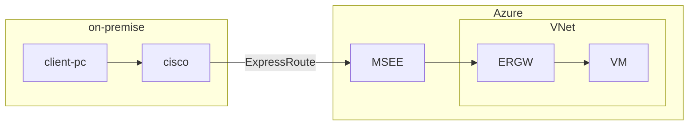
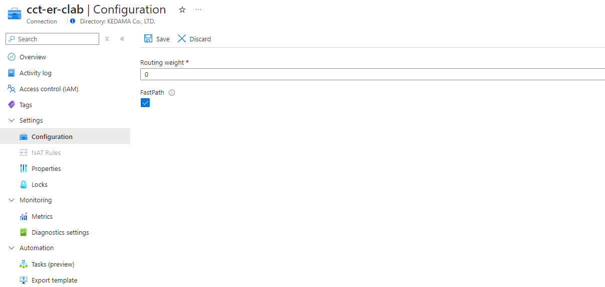
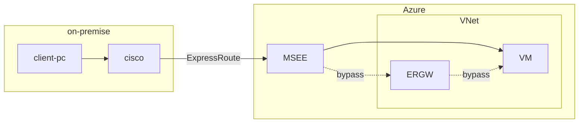

# はじめに
通常、ExpressRoute を使用する場合、オンプレミスから Azure VNet 向きの通信は ExpressRoute Gateway を通過します。 FastPath を使用することでこのゲートウェイをバイパスすることができ、多少のネットワーク パフォーマンス向上が見込めます。Azure 側からの通信については、既定でゲートウェイがバイパスされる使用になっています。
https://learn.microsoft.com/ja-jp/azure/expressroute/about-fastpath

Tech Community に投稿されているブログ[^1]でもわかりやすく解説されています。
[^1]:https://techcommunity.microsoft.com/t5/azure-networking-blog/expressroute-fastpath-for-udrs-and-vnet-peering/ba-p/4171115

注意点として、FastPath を使用するにはゲートウェイの SKU を `Ultra Performance` または `ErGw3Az` にする必要があります。

# FastPath の効果検証
FastPath の有効化前後でレイテンシがどのように変化するか確認してみます。過去の知見[^2][^3] から、計測には PsPing[^4] を使います。
[^2]:https://atmarkit.itmedia.co.jp/ait/articles/1911/20/news009.html
[^3]:https://qiita.com/tokawa-ms/items/bf0784fd00cbe88d8663
[^4]:https://learn.microsoft.com/ja-jp/sysinternals/downloads/psping

## FastPath 無効化状態
次のような構成で検証しています。


`PsPing` を何度か試してみます。

```powershell
PS C:\Users\shizh\Downloads\PSTools> .\psping.exe 10.128.1.4:3389

PsPing v2.12 - PsPing - ping, latency, bandwidth measurement utility
Copyright (C) 2012-2023 Mark Russinovich
Sysinternals - www.sysinternals.com

TCP connect to 10.128.1.4:3389:
5 iterations (warmup 1) ping test:
Connecting to 10.128.1.4:3389 (warmup): from 10.100.10.2:46132: 3.81ms
Connecting to 10.128.1.4:3389: from 10.100.10.2:46135: 4.25ms
Connecting to 10.128.1.4:3389: from 10.100.10.2:46138: 3.81ms
Connecting to 10.128.1.4:3389: from 10.100.10.2:46140: 4.52ms
Connecting to 10.128.1.4:3389: from 10.100.10.2:46142: 4.74ms

TCP connect statistics for 10.128.1.4:3389:
  Sent = 4, Received = 4, Lost = 0 (0% loss),
  Minimum = 3.81ms, Maximum = 4.74ms, Average = 4.33ms

PsPing v2.12 - PsPing - ping, latency, bandwidth measurement utility
Copyright (C) 2012-2023 Mark Russinovich
Sysinternals - www.sysinternals.com

TCP connect to 10.128.1.4:3389:
5 iterations (warmup 1) ping test:
Connecting to 10.128.1.4:3389 (warmup): from 10.100.10.2:46194: 4.68ms
Connecting to 10.128.1.4:3389: from 10.100.10.2:46195: 4.97ms
Connecting to 10.128.1.4:3389: from 10.100.10.2:46197: 4.16ms
Connecting to 10.128.1.4:3389: from 10.100.10.2:46199: 3.85ms
Connecting to 10.128.1.4:3389: from 10.100.10.2:46200: 13.99ms

TCP connect statistics for 10.128.1.4:3389:
  Sent = 4, Received = 4, Lost = 0 (0% loss),
  Minimum = 3.85ms, Maximum = 13.99ms, Average = 6.74ms

PS C:\Users\shizh\Downloads\PSTools> .\psping.exe 10.128.1.4:3389

PsPing v2.12 - PsPing - ping, latency, bandwidth measurement utility
Copyright (C) 2012-2023 Mark Russinovich
Sysinternals - www.sysinternals.com

TCP connect to 10.128.1.4:3389:
5 iterations (warmup 1) ping test:
Connecting to 10.128.1.4:3389 (warmup): from 10.100.10.2:46210: 4.19ms
Connecting to 10.128.1.4:3389: from 10.100.10.2:46211: 5.12ms
Connecting to 10.128.1.4:3389: from 10.100.10.2:46212: 4.77ms
Connecting to 10.128.1.4:3389: from 10.100.10.2:46213: 8.03ms
Connecting to 10.128.1.4:3389: from 10.100.10.2:46215: 4.16ms

TCP connect statistics for 10.128.1.4:3389:
  Sent = 4, Received = 4, Lost = 0 (0% loss),
  Minimum = 4.16ms, Maximum = 8.03ms, Average = 5.52ms

```

## FastPath 有効化状態
FastPath は Connection リソース上で有効化できます。


次のような構成で検証しています。

`PsPing` を何度か試してみます。

```powershell
PS C:\Users\shizh\Downloads\PSTools> .\psping.exe 10.128.1.4:3389

PsPing v2.12 - PsPing - ping, latency, bandwidth measurement utility
Copyright (C) 2012-2023 Mark Russinovich
Sysinternals - www.sysinternals.com

TCP connect to 10.128.1.4:3389:
5 iterations (warmup 1) ping test:
Connecting to 10.128.1.4:3389 (warmup): from 10.100.10.2:46819: 4.99ms
Connecting to 10.128.1.4:3389: from 10.100.10.2:46821: 6.72ms
Connecting to 10.128.1.4:3389: from 10.100.10.2:46822: 2.34ms
Connecting to 10.128.1.4:3389: from 10.100.10.2:46826: 2.45ms
Connecting to 10.128.1.4:3389: from 10.100.10.2:46828: 2.62ms

TCP connect statistics for 10.128.1.4:3389:
  Sent = 4, Received = 4, Lost = 0 (0% loss),
  Minimum = 2.34ms, Maximum = 6.72ms, Average = 3.53ms

PS C:\Users\shizh\Downloads\PSTools> .\psping.exe 10.128.1.4:3389

PsPing v2.12 - PsPing - ping, latency, bandwidth measurement utility
Copyright (C) 2012-2023 Mark Russinovich
Sysinternals - www.sysinternals.com

TCP connect to 10.128.1.4:3389:
5 iterations (warmup 1) ping test:
Connecting to 10.128.1.4:3389 (warmup): from 10.100.10.2:46849: 2.24ms
Connecting to 10.128.1.4:3389: from 10.100.10.2:46851: 3.54ms
Connecting to 10.128.1.4:3389: from 10.100.10.2:46852: 4.61ms
Connecting to 10.128.1.4:3389: from 10.100.10.2:46854: 2.98ms
Connecting to 10.128.1.4:3389: from 10.100.10.2:46855: 11.10ms

TCP connect statistics for 10.128.1.4:3389:
  Sent = 4, Received = 4, Lost = 0 (0% loss),
  Minimum = 2.98ms, Maximum = 11.10ms, Average = 5.56ms

PS C:\Users\shizh\Downloads\PSTools> .\psping.exe 10.128.1.4:3389

PsPing v2.12 - PsPing - ping, latency, bandwidth measurement utility
Copyright (C) 2012-2023 Mark Russinovich
Sysinternals - www.sysinternals.com

TCP connect to 10.128.1.4:3389:
5 iterations (warmup 1) ping test:
Connecting to 10.128.1.4:3389 (warmup): from 10.100.10.2:46857: 2.47ms
Connecting to 10.128.1.4:3389: from 10.100.10.2:46859: 7.13ms
Connecting to 10.128.1.4:3389: from 10.100.10.2:46860: 2.95ms
Connecting to 10.128.1.4:3389: from 10.100.10.2:46861: 3.48ms
Connecting to 10.128.1.4:3389: from 10.100.10.2:46862: 3.82ms

TCP connect statistics for 10.128.1.4:3389:
  Sent = 4, Received = 4, Lost = 0 (0% loss),
  Minimum = 2.95ms, Maximum = 7.13ms, Average = 4.35ms

PS C:\Users\shizh\Downloads\PSTools> .\psping.exe 10.128.1.4:3389

PsPing v2.12 - PsPing - ping, latency, bandwidth measurement utility
Copyright (C) 2012-2023 Mark Russinovich
Sysinternals - www.sysinternals.com

TCP connect to 10.128.1.4:3389:
5 iterations (warmup 1) ping test:
Connecting to 10.128.1.4:3389 (warmup): from 10.100.10.2:46945: 2.32ms
Connecting to 10.128.1.4:3389: from 10.100.10.2:46946: 2.92ms
Connecting to 10.128.1.4:3389: from 10.100.10.2:46947: 2.67ms
Connecting to 10.128.1.4:3389: from 10.100.10.2:46948: 3.73ms
Connecting to 10.128.1.4:3389: from 10.100.10.2:46949: 2.11ms

TCP connect statistics for 10.128.1.4:3389:
  Sent = 4, Received = 4, Lost = 0 (0% loss),
  Minimum = 2.11ms, Maximum = 3.73ms, Average = 2.86ms

```

# おわりに
全体的に眺めてみると、確かに FastPath によって多少のレイテンシ改善が見込めそうです。利用できる SKU に限りもありますが、使える場合は一考の余地があるでしょう。