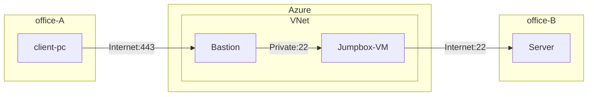

# はじめに
今回のテーマ設定の背景として、次のような要件がある環境を考えます。
- 拠点 A の端末から拠点 B のサーバーに SSH キーで SSH 接続したい
- 拠点 A からのアウトバウンドの SSH 接続は組織の要件として閉じられている
- WAN 等は利用していない
- 踏み台 VM 上に SSH Private Key は配置しない

このような要件を満たすために、Azure Bastion [^1]を利用して Azure を経由させることが考えられます。それにより、 Bastion ホストが到達可能な範囲の VM に対して、HTTPS 経由で安全にアクセスすることができます。そして、Azure 環境は SSH/RDP のアウトバウンドが閉じられていないため、拠点 B 側で VM からのインバウンド許可しておけば接続できる形になります。

[^1]:https://learn.microsoft.com/ja-jp/azure/bastion/bastion-overview



**Azure 上の踏み台 VM には SSH の Private Key を配置できない**とします。単なる踏み台なので、Private Key を保存してリスクを高めたくありませんし、共有される踏み台 VM 上に機密情報は配置したくないでしょう。

このような設定があるときに、実は Azure Bastion でポート フォワードができるという話です。

# 接続方法
## 環境構成
Azure VNet 上には Bastion と踏み台 VM を配置し、公開鍵を配置しておきます。また、検証においては、拠点 B のサーバーはパブリック IP を持つ VM とします。
## 接続
VM への接続には Windows ネイティブ クライアントを使用します。Azure CLI を Windows 環境にインストールし、次のコマンドを実行して拡張機能をインストールしておきます。

```PowerShell
$ az extension add --name ssh
$ az extension add --name bastion
```

そして、接続自体には次の `az network bastion ssh` コマンド[^2]を使用します。ドキュメントに記載に通り、実は Azure Bastion の接続をコマンドから実行する場合、一般的な SSH 接続の引数を渡すことができます。つまり、ここでポート フォワードの設定を渡してあげれば、成立するということです。
```
az network bastion ssh --auth-type
                       [--ids]
                       [--name]
                       [--resource-group]
                       [--resource-port]
                       [--ssh-key]
                       [--subscription]
                       [--target-ip-address]
                       [--target-resource-id]
                       [--username]
                       [<SSH_ARGS>]
```

[^2]:https://learn.microsoft.com/ja-jp/cli/azure/network/bastion?view=azure-cli-latest#az-network-bastion-ssh

## ポート フォワードとは？
Server1 に対して接続したいが、セキュリティやネットワークの都合上 Server2 を経由して接続する必要がある場合に、次のようにして接続することでローカルのポートを転送できます。`-L` は Local を表し、`-N` は待機状態にするオプションです。`2222` としている部分は Well-known 以外であれば何でもよいです。

```bash
$ ssh Server2 -L 2222:Server1:22 -N
```

上記コマンドでポート フォワードが成立している環境下で、設定したローカル ポートめがけて SSH 接続をすればフォワードされて Server1 に到達できるというわけです。

これを Azure Bastion 経由でも行います。

## Azure Bastion 経由のポート フォワード

最終的に接続したいサーバーを今回は Azure VM として作成しているため、踏み台 VM のパブリック IP アドレスからの SSH 接続を NSG で許可する必要があります。

ローカル端末で次のコマンドを実行して踏み台 VM に対してポート フォワードを設定します。

```bash
$ az network bastion ssh --name <bastion-name> --resource-group <rg-name> --target-resource-id <vm-resource-id> --auth-type ssh-key --ssh-key <path-to-ssh-key> --username AzureAdmin -- -L 2222:<接続先サーバー IP>:22
```

その後、別のセッションを立ち上げ、次のコマンドを実行することで Azure 越しにアクセスしたかったサーバーへ接続できます。`127.0.0.1` は `localhost` でも問題ないです。

```bash
$ ssh AzureAdmin@127.0.0.1 -p 2222 -i <path-to-ssh-key>
AzureAdmin@vmlogserverpublic:~$ 
```

以上です。

# おわりに
今回は、拠点のネットワーク要件から Azure を経由して別拠点のサーバーに接続するという方法を試しました。Bastion のネイティブクライアントでは、SSH の一般的な引数を渡すことができるため、汎用性が高いですね。
