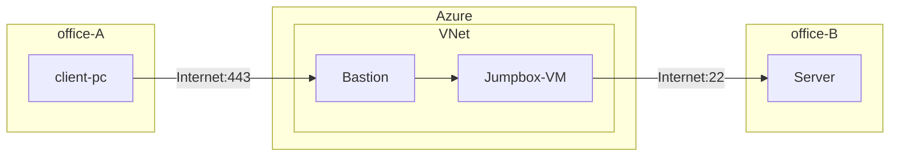

# はじめに
今回のテーマ設定の背景として、次のような要件がある環境を考えます。
- 拠点 A の端末から拠点 B のサーバーに SSH キーで SSH 接続したい
- 拠点 A からのアウトバウンドの SSH 接続は組織の要件として閉じられている
- WAN 等は利用していない

このような要件を満たすために、Azure Bastion を利用して Azure を経由させることが考えられます。それにより、 Bastion ホストが到達可能な範囲の VM に対して、HTTPS 経由で安全にアクセスすることができます。そして、Azure 環境は SSH/RDP のアウトバウンドが閉じられていないため、拠点 B 側で VM からのインバウンド許可しておけば接続できる形になります。



また、さらに追加の要件として **Azure 上の VM には SSH の Private Key を配置できない**とします。単なる踏み台なので、Private Key を保存してリスクを高めたくないとか、共有される踏み台 VM 上に機微な情報は配置したくないでしょう。

このような設定があるときに、実は Azure Bastion でポートフォワードができるという話です。

# 接続方法
## 環境構成
Azure VNet 上には Bastion と踏み台 VM を配置し、公開鍵を配置しておきます。また、検証においては、拠点 B のサーバーはパブリック IP を持つ VM とします。
## 接続
VM への接続には Windows ネイティブ クライアントを使用します。Azure CLI を Windows 環境にインストールし、次のコマンドを実行して拡張機能をインストールしておきます。

```PowerShell
az extension add --name ssh
az extension add --name bastion
```


https://learn.microsoft.com/ja-jp/cli/azure/network/bastion?view=azure-cli-latest#az-network-bastion-ssh

