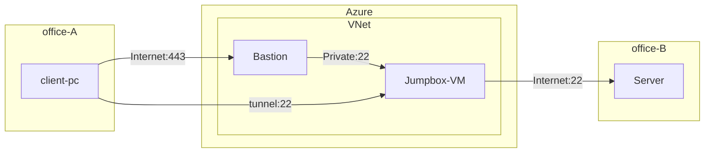

# はじめに
前回の記事[^1] と同様に以下の要件があると仮定した際に、SSH のエージェント フォワードを利用することで実現するパターンについて考えます。拠点から直接の SSH 接続が共通ファイアウォールにより閉じられているので、Azure Bastion によって回避しつつ、多段の SSH を行う必要があるというイメージです。

[^1]:https://zenn.dev/microsoft/articles/20240823-bastion-portfwd

- 拠点 A の端末から拠点 B のサーバーに SSH キーで SSH 接続したい
- 拠点 A からのアウトバウンドの SSH 接続は組織の要件として閉じられている
- WAN 等は利用していない
- 踏み台 VM 上に SSH Private Key は配置しない



# 接続方法
## 環境構成
Azure VNet 上には Bastion と踏み台 VM を配置し、Public Key を配置しておきます。また、検証においては、拠点 B のサーバーはパブリック IP を持つ VM とし、同じ Public Key を登録します。

## 接続
VM への接続には Windows ネイティブ クライアントを使用します。Azure CLI を Windows 環境にインストールし、次のコマンドを実行して拡張機能をインストールしておきます。
```bash
$ az extension add --name ssh
$ az extension add --name bastion
```

`az network bastion tunnel` コマンドによりトンネルを張ります。
```bash
$ az network bastion tunnel --name <bastion-name> --resource-group <resource-group-name> --target-resource-id <target-vm-resource-id> --resource-port "22" --port <local-machine-port>
```

ssh-agent を起動します。
```
$ eval "$(ssh-agent)"
```

ssh-agent に private key を登録します。
```bash
$ ssh-add <your-ssh-private-key>
Identity added: <your-ssh-private-key>(xxxx@xxxx)
```

別のセッションを開き、`-A` オプションを指定して、踏み台サーバーにログインします。
```
$ ssh –A <username>@127.0.0.1 –p <local-machine-port> –i <your-ssh-private-key>
```

踏み台サーバー上で設定したキーが認識されていることを確認します。
```
$ ssh-add -l
```

目的のサーバーにログインします。この際、踏み台サーバー上に private key を配置していないにもかかわらず、対象サーバーにログインできます。
```
$ ssh <username>@TargetServer
```

# おわりに
今回は、拠点のネットワーク要件から Azure を経由して別拠点のサーバーに接続するという方法を試しました。トンネルモードで接続すると、通常の ssh コマンドを利用できるため、エージェント フォワードが使用できました。ニッチな例ですが、ご参考になれば幸いです。