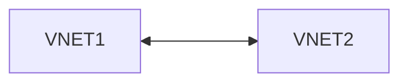
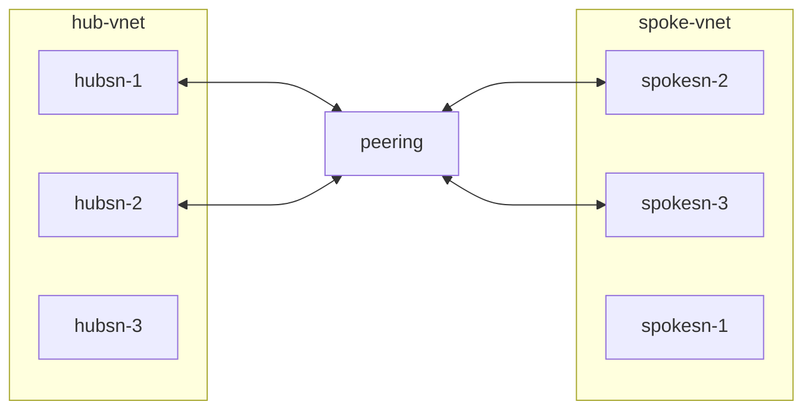
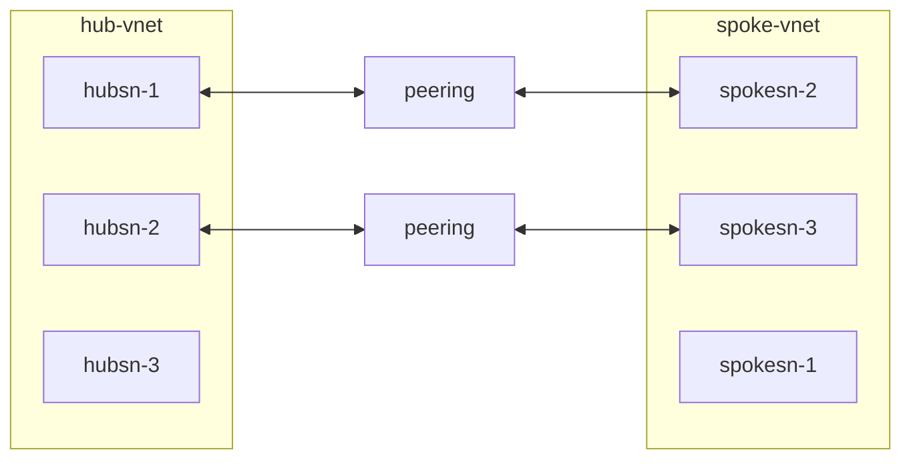

# はじめに
先日 JAZUG[^1] に参加していたら Azure Subnet Peering[^2] というワードが聞こえてきました。調べてみると、これは VNet ピアリングに参加するサブネットを選択できる機能のようでした(説明上、サブネット ピアリングと呼ぶ)。
現時点ではドキュメント化もサポートもしていないようですが、機能としては試せるようなので、手元で検証してみようとういうのが本記事の趣旨になります。

[^1]:https://jazug.connpass.com/event/327273/
[^2]:https://blog.cloudtrooper.net/2024/10/01/azure-subnet-peering/?blogid=113559092&blogsub=confirming#subscribe-blog

# 概念

通常の VNet ピアリングでは、VNet 全体同士を接続するため、ルーティングのレベルでお互いのネットワークが見えるようになります。

サブネット ピアリングでは、次のようにサブネットを選択的に接続できるというもののようです。

下図のような、サブネット単位で個別にピアリングを貼るものではないようです。

本記事では、実際に VNet を二つ用意してピアリングを構成してみます。
## リソース プロバイダの追加
この機能を使用するためのリソース プロバイダーを追加します。Registered になるまで結構時間がかかりました。

```bash:Azure Cloud Shell
$ az feature register --namespace Microsoft.Network --name AllowMultiplePeeringLinksBetweenVnets 
$ az feature show --name AllowMultiplePeeringLinksBetweenVnets --namespace Microsoft.Network --query 'properties.state' -o tsv
Registered
```
# 検証
## サブネット ピアリングの作成
```bash
// hub --> spoke peering
$ az network vnet peering create -n "hub-spoke" -g 20241006-subnetpeering --vnet-name hub-1006 --remote-vnet spoke-1006 --allow-forwarded-traffic --allow-vnet-access --peer-complete-vnets false --local-subnet-names hubsn-1 hubsn-2 --remote-subnet-names spokesn-2 spokesn-3

// spoke --> hub peering
// replace hub <-> spoke and excute command
$ az network vnet peering create -n "hub-spoke" -g 20241006-subnetpeering --vnet-name spoke-1006 --remote-vnet hub-1006 --allow-forwarded-traffic --allow-vnet-access --peer-com
plete-vnets false --remote-subnet-names hubsn-1 hubsn-2 --local-subnet-names spokesn-2 spokesn
-3
```

## ピアリングの状態の確認
サブネット ピアリングの情報を表示してみます。確かに、サブネット同士で接続されていることが見て取れます。デプロイ時に指定したように `"peerCompleteVnets": false` となっていることが重要です。
```bash
$ az network vnet peering show -g 20241006-subnetpeering -n hub-spoke --vnet-name hub-1006
{
  "allowForwardedTraffic": true,
  "allowGatewayTransit": false,
  "allowVirtualNetworkAccess": true,
  "doNotVerifyRemoteGateways": false,
  "etag": "W/\"ebb30e38-baa1-4f3b-bdb4-9ee5fbe3feea\"",
  "id": "/subscriptions/xxxx/resourceGroups/20241006-subnetpeering/providers/Microsoft.Network/virtualNetworks/hub-1006/virtualNetworkPeerings/hub-spoke",
  "localAddressSpace": {
    "addressPrefixes": [
      "10.0.0.0/24",
      "10.0.1.0/24"
    ]
  },
  "localSubnetNames": [
    "hubsn-1",
    "hubsn-2"
  ],
  "localVirtualNetworkAddressSpace": {
    "addressPrefixes": [
      "10.0.0.0/24",
      "10.0.1.0/24"
    ]
  },
  "name": "hub-spoke",
  "peerCompleteVnets": false,
  "peeringState": "Connected",
  "peeringSyncLevel": "FullyInSync",
  "provisioningState": "Succeeded",
  "remoteAddressSpace": {
    "addressPrefixes": [
      "10.50.1.0/24",
      "10.50.2.0/24"
    ]
  },
  "remoteSubnetNames": [
    "spokesn-2",
    "spokesn-3"
  ],
  "remoteVirtualNetwork": {
    "id": "/subscriptions/xxxx/resourceGroups/20241006-subnetpeering/providers/Microsoft.Network/virtualNetworks/spoke-1006",
    "resourceGroup": "20241006-subnetpeering"
  },
  "remoteVirtualNetworkAddressSpace": {
    "addressPrefixes": [
      "10.50.1.0/24",
      "10.50.2.0/24"
    ]
  },
  "remoteVirtualNetworkEncryption": {
    "enabled": false,
    "enforcement": "AllowUnencrypted"
  },
  "resourceGroup": "20241006-subnetpeering",
  "resourceGuid": "7d094ab1-fbb8-0e6a-14bb-3772c1daf7ae",
  "type": "Microsoft.Network/virtualNetworks/virtualNetworkPeerings",
  "useRemoteGateways": false
}
```

参考までに、従来通りの VNet ピアリングの例はこちら。この場合は、VNet 同士の接続設定となっており、`"peerCompleteVnets": true` となっています。
```
$ az network vnet peering show -g 20241006-testhubspoke -n hub-spoke --vnet-name hub-1006
{
  "allowForwardedTraffic": true,
  "allowGatewayTransit": false,
  "allowVirtualNetworkAccess": true,
  "doNotVerifyRemoteGateways": false,
  "etag": "W/\"00c4d680-8c49-4d50-987c-058e971aac00\"",
  "id": "/subscriptions/xxxx/resourceGroups/20241006-testhubspoke/providers/Microsoft.Network/virtualNetworks/hub-1006/virtualNetworkPeerings/hub-spoke",
  "name": "hub-spoke",
  "peerCompleteVnets": true,
  "peeringState": "Connected",
  "peeringSyncLevel": "FullyInSync",
  "provisioningState": "Succeeded",
  "remoteAddressSpace": {
    "addressPrefixes": [
      "10.50.0.0/16"
    ]
  },
  "remoteVirtualNetwork": {
    "id": "/subscriptions/xxxx/resourceGroups/20241006-testhubspoke/providers/Microsoft.Network/virtualNetworks/spoke-1006",
    "resourceGroup": "20241006-testhubspoke"
  },
  "remoteVirtualNetworkAddressSpace": {
    "addressPrefixes": [
      "10.50.0.0/16"
    ]
  },
  "remoteVirtualNetworkEncryption": {
    "enabled": false,
    "enforcement": "AllowUnencrypted"
  },
  "resourceGroup": "20241006-testhubspoke",
  "resourceGuid": "b9411bbe-3272-03ff-39f8-398648ccbce1",
  "type": "Microsoft.Network/virtualNetworks/virtualNetworkPeerings",
  "useRemoteGateways": false
}
```

## VNet ピアリングは追加できるか？
サブネット ピアリングが存在する状況で、VNet ピアリングを追加できるかを試したところ、他のピアリングがあることにより追加できませんでした。
```bash
$ az network vnet peering create -g 20241006-subnetpeering -n vnetpeering --vnet-name hub-1006 --remote-vnet spoke-1006 --allow-v
net-access
Message: Peering /subscriptions/xxxx/resourceGroups/20241006-subnetpeering/providers/Microsoft.Network/virtualNetworks/hub-1006/virtualNetworkPeerings/hub-spoke already references remote virtual network Id: /subscriptions/xxxx/resourceGroups/20241006-subnetpeering/providers/Microsoft.Network/virtualNetworks/spoke-1006
```

## サブネット ピアリングは追加できるか？
例えば後からサブネットが増えた場合や、サブネット間での通信要件が発生した場合に追加できるかということを確認します。試してみると、先ほどと同じメッセージにより作成できませんでした。結局は　VNet to VNet でのピアリングは1つである必要があるということです。

```
$ az network vnet peering create -n "hub1-spoke1" -g 20241006-subnetpeering --vnet-name hub-1006 --remote-vnet spoke-1006 --allow
-forwarded-traffic --allow-vnet-access --peer-complete-vnets false --local-subnet-names hubsn-1 --remote-subnet-names spokesn-1
Message: Peering /subscriptions/xxxx/resourceGroups/20241006-subnetpeering/providers/Microsoft.Network/virtualNetworks/hub-1006/virtualNetworkPeerings/hub12-spoke23 already references remote virtual network Id: /subscriptions/xxxx/resourceGroups/20241006-subnetpeering/providers/Microsoft.Network/virtualNetworks/spoke-1006
```

## サブネット ピアリングの更新は可能
同じピアリング名で、` --local-subnet-names` や `--remote-subnet-names` 自体を更新することは可能でした。つまり、サブネット ピアリングにどのサブネットを含めるかというコントロールは都度できます。(`--remote-subnet-names` に `spokesn-3` を追加した例)
```bash
$ az network vnet peering create -n "hub-spoke" -g 20241006-subnetpeering --vnet-name hub-1006 --remote-vnet spoke-1006 --allow-forwarded-traffic --allow-vnet-access --peer-complete-vnets false --local-subnet-names hubsn-1 hubsn-2 --remote-subnet-names spokesn-1 spokesn-2 spokesn-3
```

ピアリングの片側を更新した場合、同期されるまで設定変更がされませんのでお忘れなく。

## NIC の経路確認
最後に、`hubsn-1` に VM を立てて、effective route を確認してみます。確かに、`/16` 全体ではなく、`spokesn-2`、`spokesn-3` の `/24` のアドレスのみが見えていることが分かります。
```bash
$ az network nic show-effective-route-table -g 20241006-subnetpeering -n vm-hubsn1554 -o table
Source    State    Address Prefix    Next Hop Type    Next Hop IP
--------  -------  ----------------  ---------------  -------------
Default   Active   10.0.0.0/16       VnetLocal
Default   Active   10.50.1.0/24      VNetPeering
Default   Active   10.50.2.0/24      VNetPeering
Default   Active   0.0.0.0/0         Internet
Default   Active   10.0.0.0/8        None
Default   Active   127.0.0.0/8       None
Default   Active   100.64.0.0/10     None
Default   Active   172.16.0.0/12     None
Default   Active   25.176.0.0/13     None
Default   Active   25.152.0.0/14     None
Default   Active   25.184.0.0/14     None
Default   Active   25.4.0.0/14       None
Default   Active   25.148.0.0/15     None
Default   Active   198.18.0.0/15     None
Default   Active   25.150.0.0/16     None
Default   Active   25.156.0.0/16     None
Default   Active   25.159.0.0/16     None
Default   Active   40.109.0.0/16     None
Default   Active   192.168.0.0/16    None
Default   Active   104.147.0.0/16    None
Default   Active   157.59.0.0/16     None
Default   Active   40.108.0.0/17     None
Default   Active   104.146.0.0/17    None
Default   Active   23.103.0.0/18     None
Default   Active   20.35.252.0/22    None
```
# おわりに
ニュー概念としてどうやら動き始めているサブネット ピアリング(正式名称不明)を試してみました。これを使うと NSG で頑張って制御している部分がルートテーブルのレベルで分離できるようになり、厳密な制御が行える余地が増えるかもしれません(どうやら Subnet-to-Subnet のピアリングでは無さそうなので、そこまで柔軟ではないかもしれませんが)。なんとなく、Azure Virtual Network Manager のサブネット用ネットワーク グループとつながりそうだなと個人的には睨んでいます。 

いずれにしても、まだ未知の情報が多すぎるのでこれから、という感じですね。
