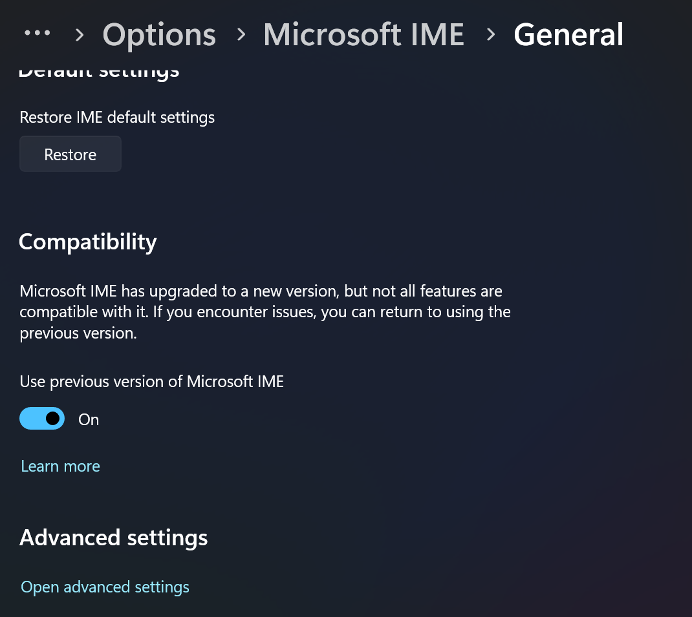
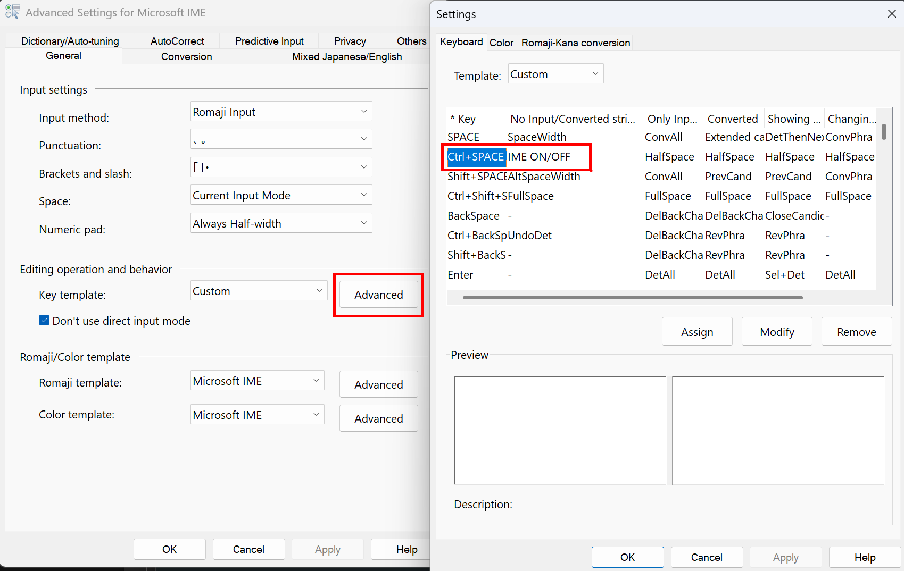
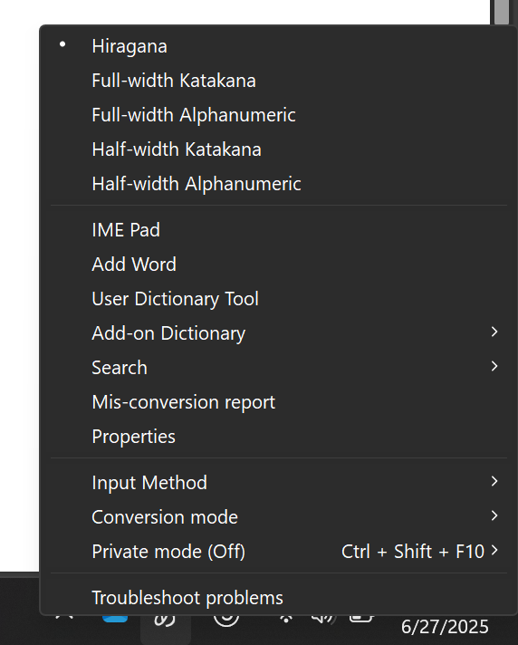
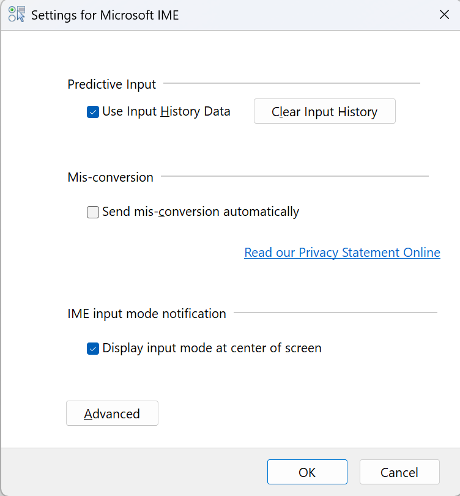
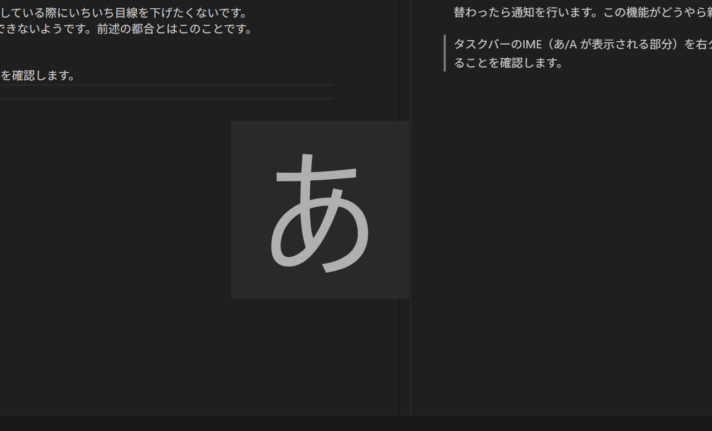
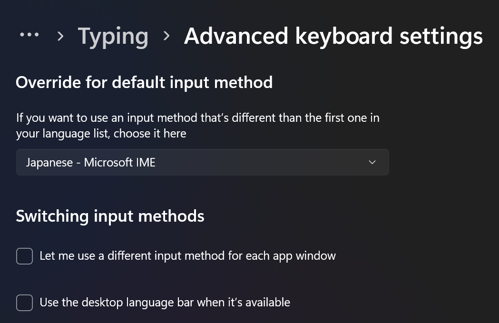

# はじめに
こんにちは。US 配列のキーボード愛好家です。以前 Macbook を使用していた時に、その外観のすっきりさから US 配列のキーボードを選択し続けた結果、日本で手に入る Windows マシンの大半が JIS 配列である事実に悲しんでおります。
とはいえ、海外から輸入するなどして、依然として Windows においても US 配列ライフを送っています。
Windows マシンを伸長するたびに IME の設定どうだったっけなと迷うので、ここにまとめておきます。

# CTRL + SPACE による IME 切り替え 
US 配列で、日本語入力と英語入力の切り替えを行う方法はいろいろあると思いますが、個人的には、`CTRL` + `SPACE` による切り替えが好きです。
後の設定の都合上、Use previous version of Microsoft IME を有効化します。

IME 設定 > General > Editing operation and behavior > CTRL+SPACE に IME ON/OFF を設定します。

# 入力文字の通知を有効化
Windows では、今入力している文字の言語がタスクバーに表示されますが、何かテキスト入力をしている際にいちいち目線を動かしたくないです。
そこで、IME が切り替わったら通知を行います。この機能がどうやら新しい IME 設定では設定できないようです。前述の都合とはこのことです。

タスクバーのIME（あ/A が表示される部分）を右クリック、Properies を表示します。

表示される設定で、Display input mode at center of screen にチェックが入っていることを確認します。

これを行うと、IME が切り替わると画面の中央に あ/A が表示されるようになります。

# IME が ENG へ切り替わることを防ぐ
OS の言語を English にしていると、デフォルトの入力言語が ENG になり、スリープのたびに ENG になってしまいます。
このわずらわしさを避けるため、`Settings` > `Time & Language` > `Typing` > `Advanced keyboard settings` で以下を設定します。
-  Let me use a different input method for each app window → オフ
-  Override for default input method → Japanese - Microsoft IME を選択 

# おわりに
以前の IME 設定に頼りきりなのは少し心配です。