# Azure Virtual WAN におけるインターネット通信制御
Azure Virtual WAN は拠点や VNET を Virtual WAN Hub (移行、VWAN Hub) に VPN 接続、ExpressRoute 接続、VNET 接続によって接続することで、Any-to-Any の接続を可能にする WAN のようなサービスです。VWAN Hub を Hub とする Hub-Spoke 構成が出来上がるわけですが、この場合の Spoke からのインターネット接続をどうするかはしばしば議題に上がります。

主な経路としては以下の3点が考えられます。
1. Spoke 側で直接出す（ローカル ブレークアウト）
2. Azure Virtual WAN 上の FW 経由で出す
3. オンプレミス側から出す（強制トンネリング）

## 構成図
※少し概念的に書いている部分があります。

```mermaid
graph LR
    Internet{{"☁️ インターネット"}}
    subgraph Azure["☁️ Azure"]
        subgraph VWAN["Virtual WAN"]
            subgraph VHub["VWAN Hub"]
                Hub[Hub Router]
                FWH[NVA]
            end
        end
        
        subgraph Spoke1["Spoke VNet 1"]
            S1[Resources]
        end
    end    
    subgraph OnPrem["🏢 オンプレミス"]
        FW[FW]
        SW[Switch]
        OP[On-premise Servers]
        SW --- FW
    end
    

    
    S1 -->|インターネット接続①| Internet
    FWH -->|インターネット接続②| Internet
    FW -->|インターネット接続③| Internet
    SW ---|VPN/ExpressRoute| Hub
    SW --- OP
    Hub ---|VNET接続| S1
    Hub --- FWH
    
    style Hub fill:#0078d4,color:#fff
    style FWH fill:#ff9800,color:#fff
    style FW fill:#ff6b6b,color:#fff
    style VHub fill:
```

## 1.
これは、既定で採用される経路です。Azure Virtual WAN でルートテーブルを編集したり、ルーティング インテント インターネットポリシーを使用していない場合には、通常通りの VNET のアウトバウンドアクセス経路となります(①)。NAT Gateway や、Public IP 経由でのインターネット接続となります。

## 2.
セキュリティを統合的に管理したい場合、共通的に経由させる FW を経路上に配置し、そこで SNAT させてログを取得するというはよくある構成です。VWAN Hub には Azure Firewall やその他 PaloAlto などのサードパーティ ソリューション含む NVA をデプロイできます。Azure Virtual WAN では、この構成を簡単に行う設定として Routing Intent があります。インターネット宛だけでなく、プライベート宛の通信制御も同じ機能が使えますが、インターネット接続に関しては、ネクストホップを NVA に向けたデフォルトルート (0.0.0.0/0) が各接続先に広報されるようになります。これにより、VWAN Hub の NVA 経由のインターネット接続が実現します(②)。

もしくは、VWAN 上で各接続に対するルートテーブルか、Spoke 側のルートテーブルに静的なルートを追加することでもこのような構成が可能です。

## 3.
ナレッジの活用や、セキュリティ要件によって、オンプレミスで運用中の FW 経由でしかインターネット接続が認められない場合があります。クラウド上の NVA だとオンプレミス版のハードウェアと対応している機能が異なることもしばしばあります。その場合、少し遠回りとなりつつも、オンプレミスを経由させるような強制トンネリング構成が必要になります(③)。

:::message
この構成のためには、基本的にはオンプレミスからデフォルトルートをVWAN Hub 側に広報する必要がありますが、この構成は、現時点で限定的なリージョンにてプレビュー提供という状況です。

https://learn.microsoft.com/ja-jp/azure/virtual-wan/about-internet-routing#forced-tunnel
:::

# 検討事例
ここのパートでは、インターネット接続にまつわる、実際のいくつかの検討事例を随時追加していきます。

## Spoke は基本 VWAN Hub の NVA 経由とするが、特定の Spoke のみオンプレミス経由としたい
現状、VWAN Hub 一つでは、この構成は実現できません。よって、複数の VWAN Hub を用意し、オンプレミスとそれぞれ接続します。そのうえで、強制トンネリングを構成したい側のみで 0.0.0.0/0 を受け取るようにします。この経路はハブ間で伝達されません。この分離された Spoke 宛の経路はもう一方の Hub 側からも聞こえますが、リモートハブからオンプレミスに伝達される経路には、ASPATHで 65520-65520 が追加されるため、非対称ルーティングにはなりません。

```mermaid
graph LR
    Internet{{"☁️ インターネット"}}
    subgraph Azure["☁️ Azure"]
        subgraph VWAN["Virtual WAN"]
            subgraph VHub["VWAN Hub"]
                Hub[Hub Router]
                FWH[NVA]
            end
            subgraph VHub2["VWAN Hub2"]
                Hub2[Hub Router]
            end
        end        
        subgraph Spoke1["Spoke VNet 1"]
            S1[Resources]
        end
        subgraph Spoke2["Spoke VNet 2"]
            S2[Resources]
        end
    end    
    subgraph OnPrem["🏢 オンプレミス"]
        FW[FW]
        SW[Switch]
        OP[On-premise Servers]
        SW --- FW
    end
    
    FWH -->|インターネット接続②| Internet
    FW -->|インターネット接続③| Internet
    SW ---|VPN/ExpressRoute| Hub
    SW --- OP
    Hub ---|VNET接続| S1
    Hub --- FWH
    Hub2 ---|VNET接続| S2
    SW ---|VPN/ExpressRoute| Hub2

    linkStyle 0 stroke:#ff0000,stroke-width:2px
    linkStyle 2 stroke:#ff0000,stroke-width:2px
    linkStyle 7 stroke:#ff0000,stroke-width:2px
    linkStyle 8 stroke:#ff0000,stroke-width:2px

    linkStyle 1 stroke:#fff000,stroke-width:2px
    linkStyle 5 stroke:#fff000,stroke-width:2px
    linkStyle 6 stroke:#fff000,stroke-width:2px
    
    style Hub fill:#0078d4,color:#fff
    style Hub2 fill:#0078d4,color:#fff

    style FWH fill:#ff9800,color:#fff
    style FW fill:#ff6b6b,color:#fff
    style VHub fill:
```

