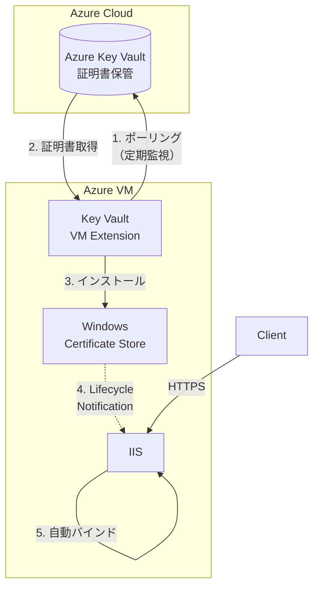

:::message
本記事は筆者個人の検証結果に基づくものであり、所属する組織の公式見解を示すものではありません。正確な情報や最新の仕様については、公式ドキュメントをご確認ください。
:::

## TL;DR
- SSL/TLS 証明書の有効期間が 2029年に **47日** へ短縮されるため、証明書の自動更新が必須に
- **Azure Key Vault VM 拡張機能（v3.0以降）** と **IIS の自動再バインド機能** を組み合わせることで、Azure VM 上の IIS で証明書更新を完全自動化できる
- 本記事では App Service 証明書を例に、Key Vault への格納から IIS への自動バインドまでの手順を解説

## はじめに
2025年4月、CA/Browser Forum（CA/B フォーラム）は **Ballot SC-081v3** を承認し、SSL/TLS証明書の最大有効期間を段階的に短縮することを決定しました。最終的には **47日** まで短縮されます。

| 施行日 | 最大有効期間 | DCV再利用期間 |
|--------|-------------|---------------|
| 2026年3月15日 | 200日 | 200日 |
| 2027年3月15日 | 100日 | 100日 |
| 2028年3月15日 | 100日 | 10日 |
| 2029年3月15日 | 47日 | 10日 |

### なぜ47日なのか

47日という数字は、以下のロジックに基づいています：

> **47日 = 42日（6週間）+ 5日（早期更新猶予）**

同様に、200日 = 180日（6ヶ月）+ 20日、100日 = 90日（3ヶ月）+ 10日という計算になっています。

### 短縮の目的

CA/Browser Forum[^1]がこの決定を下した背景には、3つのセキュリティ上の要請があります：

1. **攻撃の露出期間の最小化**
   - 証明書や秘密鍵が漏洩した場合でも、有効期間が短ければ悪用される期間を限定できる
   - IBM Cost of a Data Breach Report 2024 によると、認証情報の侵害は検知・封じ込めに平均292日を要し、最もコストの高い攻撃経路の一つ

2. **ドメイン検証の信頼性強化**
   - DCV（Domain Control Validation）の再利用期間も10日に短縮され、正当なドメイン所有者のみが有効な証明書を維持できる

3. **暗号アジリティの促進**
   - 短い証明書ライフサイクルにより、組織は迅速な暗号移行のためのインフラ構築を迫られる
   - 2024年8月に NIST が発表したポスト量子暗号標準（FIPS 203, 204, 205）への移行準備にも寄与

### 背景と経緯

- **Google** が "Moving Forward, Together" ロードマップで90日への短縮を提案
- **Apple** が47日への段階的短縮を提案し、Ballot SC-081v3 として提出[^2]
- **Apple、Google、Mozilla、Microsoft** の主要ブラウザベンダーすべてが賛成票を投じ、業界として統一された方向性を示した

### 影響

現在の398日から47日への短縮は、**証明書更新頻度が約8倍**になることを意味します。手動で証明書を管理している環境では、この更新頻度に対応することは現実的ではありません。
本記事では、Azure VM でホストされている IIS について、**VM 拡張機能**を用いてどのように SSL 証明書の更新を自動化できるかを紹介します。

## 前提条件
本記事では、証明書の更新自動化のために、**Azure Key Vault VM 拡張機能**[^3] を使用します。前提条件として以下の構成が必要です。

### 環境構成

| リソース | 要件 |
|----------|------|
| **Windows Server** | 2019 以降（本記事では Windows Server 2025 を使用） |
| **IIS** | インストール済み |
| **VM のマネージド ID** | システム割り当てまたはユーザー割り当て |
| **Azure Key Vault** | 証明書を格納済み |
| **Key Vault アクセス権限** | VM のマネージド ID に「シークレットの取得」権限を付与 |
| **ネットワーク** | VM から Key Vault へのアクセス（パブリックまたは Private Endpoint 経由） |

:::message
**マネージド ID の権限設定**
VM のマネージド ID には、Key Vault のアクセスポリシーで **シークレットの取得（Get）** 権限が必要です。証明書ではなくシークレットの権限である点に注意してください。
:::

## 1. App Service 証明書の Key Vault への格納
今回は、検証用に App Service 証明書を使用します。DigiCert や GlobalSign などの、外部の証明書を利用する場合は、このパートはスキップしてください。また、外部の証明書を Azure Key Vault で自動更新する手順についてはこちらの記事をご参照ください。
https://zenn.dev/microsoft/articles/20250711-digicertonazure

### App Service 証明書とは
App Service 証明書は、Azure が提供する SSL/TLS 証明書の購入・管理サービスです。GoDaddy が発行元となる公的に信頼された証明書を、Azure Portal から直接購入・管理できます。名前の通り、App Service と合わせて使うことが主な用途ですが、証明書(.pfx) をエクスポートして Web サーバへインストールすることも可能です。App Service にバインドする場合、Azure Key Vault 内に証明書を格納し、そこを読みに行く構成になります。
:::message
App Service 証明書は、Azure Key Vault 上のシークレット ストアに格納されます。
:::
Azure Portal から必要な情報を入力し、作成します。

### App Service 証明書の作成
作成した App Service 証明書の [証明書の構成] から、手順に従って Azure Key Vault に証明書を格納します。


App Service 証明書用の Azure Key Vault では、**RBAC モデルが非サポートのため、コンテナー アクセス ポリシー モデルを使用します**。証明書の格納アクションの Caller は Microsoft Azure App Service となりますが、必要なポリシーは事前に追加されています。


ドメインの検証も行い、準備完了状態であることを確認します。


:::message
注意：App Service証明書はKey Vaultアクセスポリシーのみサポート（RBACは不可）
:::

## 2. IIS への証明書の手動バインド
### なぜ Key Vault から直接バインドできないのか
IIS から直接 Key Vault を見に行って、勝手にバインドしてくれればありがたいのですが、そのようなことはできません。これは以下の理由によります。当然といえば当然ですね。
  - IIS は Windows 証明書ストア（`LocalMachine\My` 等）のみ参照可能
  - Key Vault は外部の秘密鍵ストアであり、IIS から直接参照する仕組みがない

### 手動でのバインドの流れ（参考）
ここは、.pfx を Azure portal からエクスポートし、Windows Server 上でインポートするのが早いです。その後、IIS の Site Bindings で Type:HTTPS でバインドします。


外部からアクセスすると有効な証明書が確認できます。


:::message
### IIS の「バインディング」とは何か
IIS の Binding（バインディング） は、**この Web サイトは、どの IP / ポート / ホスト名 / プロトコルで通信を受け付けるか** を定義する設定です。HTTPS の場合は、これに どの SSL/TLS 証明書を使うか が追加されます。
:::

## 3. Azure Key Vault VM 拡張機能による証明書更新の自動化
### Azure VM 拡張機能とは
Azure VM 拡張機能 (VM Extension) は、Azure VM に対してデプロイ後の構成や自動化タスクを提供する小さなアプリケーションです。各 VM でそのような拡張機能が利用できるかは、以下の Azure CLI コマンドで確認できます(何らかのフィルタをかけないと、応答にかなり時間がかかります)。
```bash
$ az vm extension image list -l japaneast -p Microsoft.Compute -o table
Name                   Publisher          Version
---------------------  -----------------  ---------
BGInfo                 Microsoft.Compute  1.0
BGInfo                 Microsoft.Compute  1.0.1
BGInfo                 Microsoft.Compute  1.1
BGInfo                 Microsoft.Compute  1.2.2
BGInfo                 Microsoft.Compute  2.1
BGInfo                 Microsoft.Compute  2.2.2
BGInfo                 Microsoft.Compute  2.2.3
BGInfo                 Microsoft.Compute  2.2.5
CustomScriptExtension  Microsoft.Compute  1.0
CustomScriptExtension  Microsoft.Compute  1.0.3
CustomScriptExtension  Microsoft.Compute  1.1
CustomScriptExtension  Microsoft.Compute  1.10.10
CustomScriptExtension  Microsoft.Compute  1.10.12
...
```
今回はその中でも、Azure Key Vault VM 拡張機能を使用します。

### Azure Key Vault VM 拡張機能
この拡張機能を使って、以下のようなフローを構成します。


#### サポートしている機能
この拡張機能は、以下の機能をサポートしています。
> Windows バージョン 3.0 の Key Vault VM 拡張機能では、次の機能がサポートされています。
>
> - ダウンロードした証明書に ACL アクセス許可を追加する
> - 証明書ストアの証明書ごとの構成を可能にする
> - 秘密キーをエクスポートする
> - IIS 証明書の再バインドのサポート

#### 拡張機能のインストール
今回は、ドキュメント[^3] に記載の方法のうち、Azure CLI を使用して拡張機能をデプロイします。デプロイには、`settings.json` として、拡張機能の設定を JSON 形式で渡す必要があります。ドキュメントにも JSON スニペットが記載されていますが、このスキーマは、メジャーバージョン 3.0 のスキーマです。マイナーバージョンも含めると、かなり多くの利用可能なバージョンが存在します。
```bash
$ az vm extension image list-versions --publisher Microsoft.Azure.KeyVault --name KeyVaultForWindows --location japaneast -o table
Location    Name
----------  ------------
japaneast   0.1.0.717
japaneast   0.2.0.898
japaneast   0.3.907.5
japaneast   1.0.1076.8
japaneast   1.0.1082.9
japaneast   1.0.1114.10
japaneast   1.0.1172.11
japaneast   1.0.1201.12
japaneast   1.0.1253.13
japaneast   1.0.1258.14
japaneast   1.0.1363.13
japaneast   1.0.1409.21
japaneast   1.0.921.6
japaneast   3.0.2138.56
japaneast   3.1.2195.61
japaneast   3.2.2398.77
japaneast   3.3.2607.99
japaneast   3.6.3145.208
japaneast   4.0.3299.265
```

今回の検証で必要な最低限のスキーマは以下のような形になります。
```json:settings.json
{
    "secretsManagementSettings": {
        "pollingIntervalInS": "3600",
        "linkOnRenewal": true,
        "observedCertificates": [
            {
                "url": "https://<your-kv-name>.vault.azure.net/secrets/<your-kv-secret-name>",
                "certificateStoreName": "MY",
                "certificateStoreLocation": "LocalMachine",
                "accounts": [
                    "IIS APPPOOL\\DefaultAppPool"
                ]
            }
        ]
    }
}
```
`accounts` に入れるべき情報は、IIS Manager 上で確認できます。`ApplicationPoolIdentity` の場合は、`IIS APPPOOL\DefaultAppPool` の形で設定する必要があります。JSON ではバックスラッシュがエスケープ文字のため、`IIS APPPOOL\\DefaultAppPool` と記述します。

`pollingIntervalInS` はポーリングの間隔を指定するプロパティですが、検証のタイミングでは 10 分など短く設定しておくとよいかもしれません。

以下のように、バージョン 3.0 を明示的に指定してデプロイします。
```bash
$ az vm extension set --name "KeyVaultForWindows" --publisher Microsoft.Azure.KeyVault --resource-group "<your-resource-group>" --vm-name "<your-vm-name>" --settings "@settings.json" --version "3.0"
```

:::message alert
**バージョン 4.0 での変更点**
バージョン指定せずに拡張機能をデプロイすると、現在の最新バージョンがデプロイされます。現時点で最新であるバージョン 4.0 では `pollingIntervalInS` や `linkOnRenewal` プロパティが廃止されています。バージョン 3.x 系を使用する場合は、明示的にバージョンを指定してください。本記事では、ドキュメントに倣って 3.0 を使用しています。
:::

## 4. IIS 側の設定：証明書の自動再バインド
Azure Key Vault VM 拡張機能は、IIS に対する証明書の自動再バインドまでは行いません。以下[^4]に記載の通り、同一 SAN の新しい証明書がインストールされた際に、Azure Key Vault VM 拡張機能の発生させるライフサイクル通知に対して IIS 側の自動再バインド機能[^5] がトリガーされることで自動更新を行います。
> IIS の場合、IIS で証明書更新の自動再バインドを有効にすることで自動再バインドを構成できます。 Azure Key Vault VM 拡張機能は、SAN が一致する証明書がインストールされると、証明書ライフサイクル通知を生成します。 IIS は、このイベントを使用して証明書を自動再バインドします。 詳細については、「 IIS での再バインドの証明書」を参照してください。

### IIS 8.5以降の「Centralized Certificate Store」または「自動再バインド」機能
証明書の再バインドを有効にすると、IIS はシステムのタスク スケジューラにタスクを登録し、タスクは証明書更新イベント (イベントID:`1001`) にトリガーするようにキーが設定されます。このトリガーに従って証明書の自動更新がなされます。

### 設定手順
IIS Manager において、サーバの証明書一覧から、`Enable Automatic Rebind of Renewed Certificate` をクリックします。表示が `Disable Automatic Rebind of Renewed Certificate` になれば、有効になっています。この設定がないと、証明書ストアに新しい証明書が入ってもバインドが更新されません。


## 5. 自動更新の検証
新しい証明書が Azure Key Vault に追加されることをトリガーに、HTTPS にバインドされた証明書が更新されることを確認します。

### 更新前の証明書の情報
更新前の情報としていくつかまとめておきます。

#### IIS Manager 上のバインディング
Serial Number: `00cb3695fdd5fe17f2`


Thumbprint(SHA-1): `328b316329c9ed0f2db147399085eca7fb98607f`


```powershell
PS C:\Windows\system32> netsh http show sslcert

SSL Certificate bindings:
-------------------------


    IP:port                      : 0.0.0.0:443
    Certificate Hash             : 328b316329c9ed0f2db147399085eca7fb98607f
    Application ID               : {4dc3e181-e14b-4a21-b022-59fc669b0914}
    Certificate Store Name       : My
...
```

#### Azure Key Vault
Secret のバージョン: `0988a8db7e0f497d9f1d071fe205260c`

### 新しい証明書の発行
検証のため、App Service 証明書の Rekey (強制更新) で新バージョンを作成します。


### 更新後の証明書情報
#### Azure Key Vault
追加された Secret のバージョン: `88bd41a1fdf645bab4fd1f14e0162ca0`

その他、照合に必要な情報はタグとして付与されています。


Azure CLI からも確認できます。
```bash
$ az keyvault secret show --vault-name akv-iiscert-jpe --name wildcard-kedamatech386b3521-3256-4f32-b716-4ec7e5703ef5 --query "{tags:tags, id:id}" -o yaml
id: https://xxxxxx.vault.azure.net/secrets/wildcard-kedamatech386b3521-3256-4f32-b716-4ec7e5703ef5/88bd41a1fdf645bab4fd1f14e0162ca0
tags:
  CertificateId: /subscriptions/xxxxxxxx/resourceGroups/20260121-appservcert-on-vm/providers/Microsoft.CertificateRegistration/certificateOrders/wildcard-kedamatech/certificates/wildcard-kedamatech
  CertificateState: Ready
  SerialNumber: 0B5922EF8E57B9FD
  Thumbprint: 6127E6E32019279687F7762E0AD08D8CA05C72A3
```

### ポーリング間隔後の動作確認
間隔を 1h で設定したため（検証なのでもっと短くすればよかったですが）、VM をしばらく放置して動きを確認します。

#### IIS Manager 上でのバインディング確認
Serial Number: `0b5922ef8e57b9fd`


Thumbprint(SHA-1): `6127e6e32019279687f7762e0ad08d8ca05c72a3`


Serial Number、Thumbprint どちらも Azure 側で確認した値に一致しています。この時点で証明書更新をトリガーとする SSL 証明書の再バインドが正しく回っていることが分かります。

#### ログの確認
Azure Key Vault VM 拡張機能の生成するログを確認します。以下のように、証明書が更新されていることが確認できます。
```powershell
PS C:\Windows\system32> Get-ChildItem "C:\WindowsAzure\Logs\Plugins\Microsoft.Azure.KeyVault.KeyVaultForWindows\3.6.3145.208\akvvm*.log" -ErrorAction SilentlyContinue | Get-Content -Tail 100
2026-01-21 13:37:24: <info> [WindowsCertificateStore]   attempting to open store 'LocalMachine\MY'
2026-01-21 13:37:24: <debug> [WindowsCertificateStore]  opening the 'LocalMachine' store..
2026-01-21 13:37:24: <debug> [WindowsCertificateStore]  store opened successfully.
2026-01-21 13:37:24: <info> [CertificateManager]        Installing latest version of 'https://xxxxx.vault.azure.net/secrets/wildcard-kedamatech386b3521-3256-4f32-b716-4ec7e5703ef5'.
2026-01-21 13:37:24: <debug> [WindowsCertificateStore]  Validated accounts for ACL: IIS APPPOOL\DefaultAppPool
2026-01-21 13:37:24: <debug> [WindowsCertificateStore]  installing certificate..
2026-01-21 13:37:24: <debug> [WindowsCertificateStore]  finding predecessors for model certificate by SAN..
2026-01-21 13:37:24: <info> [WindowsCertificateStore]   Importing the Intermediate CA: Go Daddy Secure Certificate Authority - G2
2026-01-21 13:37:24: <info> [WindowsCertificateStore]   Installed 'wildcard-kedamatech386b3521-3256-4f32-b716-4ec7e5703ef5'; most recent version is '88bd41a1fdf645bab4fd1f14e0162ca0'; issuer of the cert is 'Go Daddy Secure Certificate Authority - G2'; subject is '*.kedamatech.comkedamatech.com'; the thumbprint is '6127E6E32019279687F7762E0AD08D8CA05C72A3'
2026-01-21 13:37:24: <debug> [WindowsCertificateStore]  finding predecessors for model certificate by SAN..
2026-01-21 13:37:24: <info> [WindowsCertificateStore]   This new certificate CertificateName: 'wildcard-kedamatech386b3521-3256-4f32-b716-4ec7e5703ef5'; with thumbprint: '6127E6E32019279687F7762E0AD08D8CA05C72A3'; replaced certificate with thumbprint: '328B316329C9ED0F2DB147399085ECA7FB98607F'
2026-01-21 13:37:24: <debug> [WindowsCertificateStore]  certificate installed
2026-01-21 13:37:24: <info> [WindowsCertificateStore]   Adding ACL to CNG key.
2026-01-21 13:37:24: <debug> [WindowsCertificateStore]  Successfully applied ACL to CNG key.
2026-01-21 13:37:24: <debug> [CertificateManager]       Added ACL to certificate: https://akv-iiscert-jpe.vault.azure.net/secrets/wildcard-kedamatech386b3521-3256-4f32-b716-4ec7e5703ef5
2026-01-21 13:37:24: <info> [CertificateManager]        Completed refreshing observed certificates.
2026-01-21 13:37:24: <info> [WindowsCertificateManager] Checking state of termination event with a timeout of 3600000
```

Windows Event Log 側も確認します。確かに、1001 のイベントが発生しています。
```powershell
PS C:\Windows\system32> Get-WinEvent -LogName "Microsoft-Windows-CertificateServicesClient-Lifecycle-System/Operational" -MaxEvents 20 |
>>   Select-Object TimeCreated, Id, Message |
>>   Format-Table -Wrap

TimeCreated             Id Message
-----------             -- -------
1/21/2026 1:37:24 PM  1001 A certificate has been replaced. Please refer to the "Details" section for more information.
1/21/2026 1:37:24 PM  1006 A new certificate has been installed. Please refer to the "Details" section for more 
```

バインド中の証明書ハッシュを確認します。
```powershell
PS C:\Windows\system32> netsh http show sslcert

SSL Certificate bindings:
-------------------------


    IP:port                      : 0.0.0.0:443
    Certificate Hash             : 6127e6e32019279687f7762e0ad08d8ca05c72a3
    Application ID               : {4dc3e181-e14b-4a21-b022-59fc669b0914}
    Certificate Store Name       : My

```
上記のようないくつかのログからも、問題なく更新できていることが分かります。

#### ブラウザで証明書情報を確認
ウェブサイトにアクセスして、証明書を見てみても、きちんと更新されています。

Azure Key Vault 側の最新バージョンのアクティブ日時とも一致します。


## 6. 運用上の考慮事項
証明書の更新と再バインドはできましたが、いくつかの追加の考慮事項があります。

### 古い証明書の削除
拡張機能では、過去の証明書の自動削除はされません。期限切れの証明書を削除するバッチジョブを設定するなどの運用は必要です。


### Azure Key Vault へのセキュアなアクセス
SSL 証明書は非常に重要なデータです。Key Vault へのアクセスを Private Endpoint 経由とすることで、認証認可だけでなくネットワーク レイヤで多層防御できます。

## まとめ
Key Vault での証明書管理、Azure Key Vault VM 拡張機能の利用、IIS 自動再バインド機能の有効化、によって自動化が可能であることを確認しました。証明書については、App Service 証明書以外にも DigiCert、GlobalSign のものであれば同様の運用が可能です。 

[^1]:https://cabforum.org/2025/04/14/ballot-sc-081-v3-introduce-schedule-of-reducing-certificate-validity-and-data-reuse-periods/
[^2]:https://support.apple.com/en-us/102028
[^3]:https://learn.microsoft.com/ja-jp/azure/virtual-machines/extensions/key-vault-windows#features
[^4]:https://learn.microsoft.com/ja-jp/azure/virtual-machines/extensions/key-vault-windows#does-the-extension-support-certificate-auto-rebinding
[^5]:https://learn.microsoft.com/ja-jp/iis/get-started/whats-new-in-iis-85/certificate-rebind-in-iis85