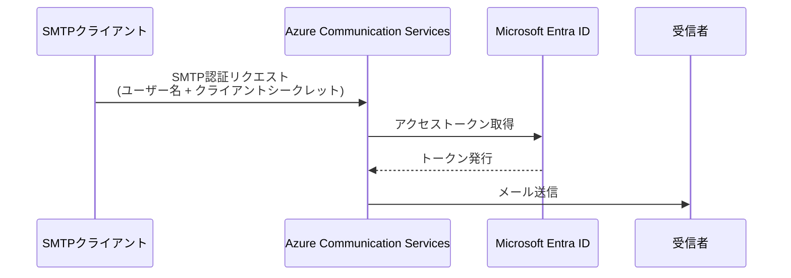

## はじめに

Azure Communication Services (ACS) は、メール送信機能を提供する Azure のサービスです。本記事では、ACS の SMTP 認証機能を使用して、PowerShell や Linux 環境からメールを送信する方法を解説します。

ACS の SMTP 認証では、Microsoft Entra ID のアプリケーション登録を利用して認証を行います。これにより、既存の SMTP クライアントから ACS 経由でメールを送信できるようになります。

## Azure での SMTP リレー構成パターン

Azure 環境からメールを送信する場合、いくつかの選択肢があります。

### 主な構成パターン

| パターン | 特徴 | ユースケース |
|----------|------|-------------|
| **Azure Communication Services** | Azure ネイティブ、Entra ID 認証 | 新規構築、Azure 統合重視 |
| **SendGrid（Azure Marketplace）** | 高機能、API/SMTP 両対応 | 大量配信、マーケティング |
| **Microsoft 365 / Exchange Online** | 既存契約の活用 | 少量配信、社内システム |
| **サードパーティ SMTP サービス** | 柔軟性が高い | 既存サービスの継続利用 |

### Azure からのメール送信における課題

Azure 環境でメール送信を構築する際には、以下の課題を考慮する必要があります。

:::message alert
**Port 25 のブロック**
Azure VM からの Port 25（SMTP）アウトバウンド通信は、スパム対策のため**既定でブロック**されています。Enterprise Agreement の場合は解除申請が可能ですが、推奨されません。
:::

| 課題 | 説明 | ACS での解決 |
|------|------|-------------|
| **Port 25 制限** | Azure VM から直接送信不可 | Port 587 + TLS で回避 |
| **IP レピュテーション** | 新規 IP は信頼性が低い | Microsoft の IP プールを利用 |
| **SPF/DKIM/DMARC** | 送信認証の設定が必要 | ACS が自動で署名 |
| **バウンス処理** | 不達メールの管理 | ACS が処理を代行 |
| **スケーラビリティ** | 大量送信時の制限 | マネージドサービスで対応 |

### なぜ Azure Communication Services を選ぶのか

本記事では **Azure Communication Services (ACS)** を使用します。ACS を選択する主な理由は以下の通りです：

- **Azure ネイティブ**：Azure Portal から一元管理可能
- **Entra ID 統合**：既存の ID 基盤を活用した認証
- **SMTP 互換**：既存アプリケーションからの移行が容易
- **マネージド**：IP レピュテーション、SPF/DKIM を自動管理
- **従量課金**：使った分だけの料金体系

## 前提条件

- Azure サブスクリプション
- Azure Communication Services リソース
- カスタムドメイン（オプション、本記事では使用）
- DNS ゾーンへのアクセス権限

## 構成の全体像



## Step 1: Entra ID アプリケーションの登録

ACS の SMTP 認証には、Managed Identity ではなく、**アプリケーション登録のサービスプリンシパル**が必要です。

### 1.1 アプリケーションの作成

1. Azure Portal で **Microsoft Entra ID** を開く
2. **アプリの登録** > **新規登録** をクリック
3. アプリケーション名を入力して登録


:::message
アプリケーション登録の詳細な手順は [Microsoft Learn のドキュメント](https://learn.microsoft.com/ja-jp/entra/identity-platform/howto-create-service-principal-portal#register-an-application-with-microsoft-entra-id-and-create-a-service-principal) を参照してください。
:::

### 1.2 クライアントシークレットの作成

1. 作成したアプリの **証明書とシークレット** を開く
2. **新しいクライアントシークレット** をクリック
3. 説明と有効期限を設定して追加


:::message alert
シークレットの値は作成時にのみ表示されます。必ずコピーして安全な場所に保管してください。
:::

## Step 2: ACS での SMTP ユーザー作成

### 2.1 アプリケーションへの権限付与

Azure Communication Services リソースで、作成した Entra アプリケーションに対して権限を付与します。


### 2.2 SMTP ユーザー名の作成

1. ACS リソースの **Email** > **SMTP credentials** を開く
2. **Create SMTP username** をクリック
3. カスタムテキストでユーザー名を作成


作成直後は「Missing Client Secret」という状態になります。


Entra 側でクライアントシークレットを作成後、しばらく待つと「Ready to use」状態になります。


## Step 3: カスタムドメインの設定

ACS でカスタムドメインからメールを送信するには、**SPF** と **DKIM** の設定が必須です。

### 3.1 ドメイン検証用レコードの追加

カスタムドメインをプロビジョニングするには、以下の手順が必要です：

1. DNS に **TXT レコード**を追加してドメイン所有権を確認
2. **SPF レコード**と **DKIM レコード**を追加してセンダー認証を構成

:::details DNS レコード設定の詳細
親ゾーンにレコードを追加する場合は、末尾にメール用のサブドメインを付けます。


:::

### 3.2 ドメインの検証完了

正しく設定すると、ドメインが「Verified」状態になります。


### 3.3 ドメインを ACS に接続

検証が完了したドメインを ACS リソースに接続します。


:::message
MailFrom アドレスの追加には、カスタムドメインの検証とより高い送信制限のプロビジョニングが必要な場合があります。詳細は [Microsoft Learn](https://learn.microsoft.com/ja-jp/azure/communication-services/quickstarts/email/add-multiple-senders?pivots=platform-azp#prerequisites) を参照してください。
:::

## Step 4: メール送信テスト

### SMTP 接続設定

| 設定項目 | 値 |
|----------|-----|
| サーバー | `smtp.azurecomm.net` |
| ポート | 587（推奨）または 25 |
| TLS/StartTLS | 有効 |
| ユーザー名 | SMTP ユーザー名 |
| パスワード | Entra アプリのクライアントシークレット |

### PowerShell での送信

```powershell:send-mail.ps1
$smtpServer = "smtp.azurecomm.net"
$smtpPort = 587
$username = "kdm-email-app"

$secret = 'your-app-client-secret'
$from = "DoNotReply@email.kdm-tech.com"
$to = "recipient@example.com"

$Password = ConvertTo-SecureString -AsPlainText -Force -String $secret
$Cred = New-Object -TypeName PSCredential -ArgumentList $username, $Password

Send-MailMessage -From $from -To $to `
  -Subject 'Test mail' `
  -Body '🐶🐶🐶🐶This is KDM-TECH test email🐶🐶🐶🐶' `
  -SmtpServer $smtpServer `
  -Port $smtpPort `
  -Credential $Cred `
  -UseSsl `
  -Encoding UTF8
```


### Linux (swaks) での送信

```bash:send-mail.sh
swaks --server smtp.azurecomm.net \
  --port 587 \
  --tls \
  --auth LOGIN \
  --auth-user "kdm-email-app" \
  --auth-password "your-app-client-secret" \
  --from "DoNotReply@email.kdm-tech.com" \
  --to "recipient@example.com" \
  --header "Subject: WSLからのテストメール" \
  --header "Content-Type: text/plain; charset=UTF-8" \
  --body "🐶🐶🐶🐶 これは KDM-TECH テストメールです 🐶🐶🐶🐶"
```


## トラブルシューティング

:::details MailFrom アドレスが追加できない場合
カスタムドメインで MailFrom アドレスを追加できない場合は、以下を確認してください：

1. SPF と DKIM の設定が正しく完了しているか
2. ドメインが「Verified」状態になっているか
3. より高い送信制限のプロビジョニングが必要な場合、サポートリクエスト（SR）が必要


:::

:::details Missing Client Secret エラー
SMTP ユーザーが「Missing Client Secret」状態の場合：

1. Entra アプリケーションでクライアントシークレットを作成
2. 数分待って状態が更新されるのを確認
:::

## まとめ

本記事では、Azure Communication Services の SMTP 認証機能を使用してメールを送信する方法を解説しました。

**ポイント**
- ACS の SMTP 認証には Entra ID のアプリケーション登録が必要
- カスタムドメインを使用する場合は SPF/DKIM の設定が必須
- 認証情報は SMTP ユーザー名 + クライアントシークレットの組み合わせ

この構成により、既存の SMTP 対応アプリケーションから Azure 経由でメールを送信できるようになります。

## 参考リンク

- [Azure Communication Services - Email ドキュメント](https://learn.microsoft.com/ja-jp/azure/communication-services/concepts/email/email-overview)
- [カスタムの検証済みメール ドメインを追加する](https://learn.microsoft.com/ja-jp/azure/communication-services/quickstarts/email/add-custom-verified-domains?pivots=platform-azp)
- [複数の送信者を追加する](https://learn.microsoft.com/ja-jp/azure/communication-services/quickstarts/email/add-multiple-senders?pivots=platform-azp)
- [Entra アプリケーション登録](https://learn.microsoft.com/ja-jp/entra/identity-platform/howto-create-service-principal-portal)
