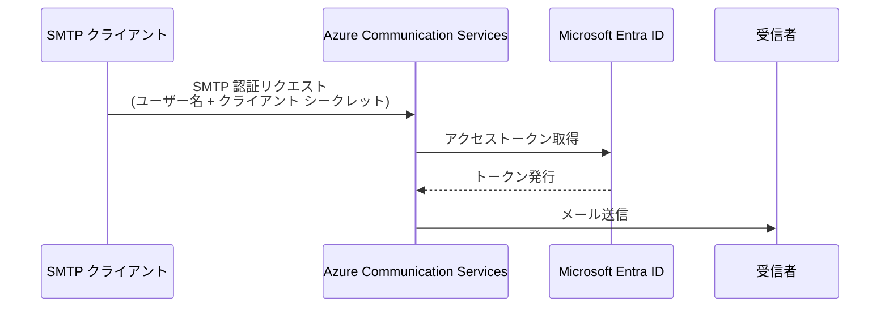

:::message
本記事は筆者個人の検証結果に基づくものであり、所属する組織の公式見解を示すものではありません。
正確な情報や最新の仕様については、公式ドキュメントをご確認ください。
:::

# はじめに

Azure Communication Services (ACS) は、メール送信機能を提供する Azure のサービスです。本記事では、ACS の SMTP 認証機能を使用して、Windows や Linux 環境からメールを送信する方法を解説します。

ACS の SMTP 認証は **SMTP AUTH（ユーザー名 + パスワード）** ですが、その資格情報として **Microsoft Entra ID のアプリケーション登録（サービスプリンシパル）の情報**を利用します。

具体的には、SMTP パスワードは **Entra アプリのクライアント シークレット**であり、ACS 側がその情報を使って **Entra にトークンを取得**し、メール送信を承認します。このため、既存の SMTP クライアントから ACS 経由で送信でき、かつ Entra による認証・認可の管理が可能になります。

# Azure での SMTP リレー構成パターン

Azure 環境からメールを送信する場合、いくつかの選択肢があります。

## 主な構成パターン

| パターン | 特徴 | ユースケース |
|----------|------|-------------|
| **Azure Communication Services** | Azure ネイティブ、Entra ID 認証 | 新規構築、Azure 統合重視 |
| **SendGrid（Azure Marketplace）** | 高機能、API/SMTP 両対応 | 大量配信、マーケティング |
| **Microsoft 365 / Exchange Online** | 既存契約の活用 | 少量配信、社内システム |
| **サードパーティ SMTP サービス** | 柔軟性が高い | 既存サービスの継続利用 |

## Azure からのメール送信における課題

Azure 環境でメール送信を構築する際には、以下の課題を考慮する必要があります。

:::message alert
**ポート 25 のブロック**
Azure VM からのポート 25（SMTP）アウトバウンド通信は、スパム対策のため**既定でブロック**されています。Enterprise Agreement の場合は解除申請が可能ですが、推奨されません。オンプレミスや他クラウドから送信する場合はポート 25 を利用できることもありますが、本記事ではポート 587 + TLS を前提にします。
:::

| 課題 | 説明 | ACS での解決 |
|------|------|-------------|
| **ポート 25 制限** | Azure VM から直接送信不可 | ポート 587 + TLS で回避 |
| **IP レピュテーション** | 新規 IP は信頼性が低い | Microsoft の IP プールを利用 |
| **SPF/DKIM/DMARC** | 送信認証の設定が必要 | ACS が自動で署名 |
| **バウンス処理** | 不達メールの管理 | ACS が処理を代行 |
| **スケーラビリティ** | 大量送信時の制限 | マネージドサービスで対応 |

## なぜ Azure Communication Services を選ぶのか

本記事では **Azure Communication Services (ACS)** を使用します。ACS を選択する主な理由は以下の通りです：

- **Azure ネイティブ**：Azure Portal から一元管理可能
- **Entra ID 統合**：既存の ID 基盤を活用した認証
- **SMTP 互換**：既存アプリケーションからの移行が容易
- **マネージド サービス**：IP レピュテーション、SPF/DKIM を自動管理
- **従量課金**：使った分だけの料金体系

# 前提条件

- Azure サブスクリプション
- Azure Communication Services リソース
- カスタムドメイン（オプション、本記事では使用）
- DNS ゾーンへのアクセス権限

対象読者：既存の SMTP クライアントから ACS への移行を検討している方

ACS Email には利用可能リージョンと送信制限があります。事前に公式ドキュメントで確認してください。

# 構成の全体像


```mermaid
sequenceDiagram
    participant Client as SMTP クライアント
    participant ACS as Azure Communication Services
    participant Entra as Microsoft Entra ID
    participant Recipient as 受信者

    Client->>ACS: SMTP 認証リクエスト<br/>(ユーザー名 + クライアント シークレット)
    ACS->>Entra: アクセストークン取得
    Entra-->>ACS: トークン発行
    ACS->>Recipient: メール送信
```

# Step 1: Entra ID アプリケーションの登録

ACS の SMTP 認証には、Managed Identity ではなく、**アプリケーション登録のサービスプリンシパル**が必要です。

## 1.1 アプリケーションの作成

1. Azure Portal で **Microsoft Entra ID** を開く
2. **アプリの登録** > **新規登録** をクリック
3. アプリケーション名を入力して登録


:::message
アプリケーション登録の詳細な手順は [Microsoft Learn のドキュメント](https://learn.microsoft.com/ja-jp/entra/identity-platform/howto-create-service-principal-portal#register-an-application-with-microsoft-entra-id-and-create-a-service-principal) を参照してください。
:::

## 1.2 クライアント シークレットの作成

1. 作成したアプリの **証明書とシークレット** を開く
2. **新しいクライアント シークレット** をクリック
3. 説明と有効期限を設定して追加


:::message alert
シークレットの値は作成時にのみ表示されます。必ずコピーして安全な場所に保管してください。
:::

# Step 2: ACS での SMTP ユーザー作成

## 2.1 アプリケーションへの権限付与

Azure Communication Services リソースで、作成した Entra アプリケーションに対して権限を付与します。


## 2.2 SMTP ユーザー名の作成

1. ACS リソースの **Email** > **SMTP credentials** を開く
2. **Create SMTP username** をクリック
3. カスタムテキストでユーザー名を作成


作成直後は「Missing Client Secret」という状態になります。


Entra 側でクライアント シークレットを作成後、しばらく待つと「Ready to use」状態になります。


# Step 3: カスタムドメインの設定

ACS でカスタムドメインからメールを送信するには、**SPF** と **DKIM** の設定が必須です。

## 3.1 ドメイン検証用レコードの追加

カスタムドメインをプロビジョニングするには、以下の手順が必要です：

1. DNS に **TXT レコード**を追加してドメイン所有権を確認
2. **SPF レコード**と **DKIM レコード**を追加してセンダー認証を構成

親ゾーンにレコードを追加する場合は、末尾にメール用のサブドメインを付けます。今回の場合、ACS のメール配信用に email.kdm-tech.com というサブドメインを切っています。その場合に kdm-tech.com ゾーンに SPF/DKIM 用のレコードを追加しています。


レコードを追加するゾーンと入力する内容の対応は以下ドキュメントに記載があります。
https://learn.microsoft.com/ja-jp/azure/communication-services/quickstarts/email/add-custom-verified-domains?pivots=platform-azp#configure-sender-authentication-for-custom-domain

## 3.2 ドメインの検証完了

正しく設定すると、ドメインが「Verified」状態になります。


## 3.3 ドメインを ACS に接続

検証が完了したドメインを ACS リソースに接続します。


:::message
本検証では、MailFrom アドレスの追加が無効化されており、任意のアドレスの追加ができませんでした。DoNotReply 以外のアドレスの追加のためには、カスタムドメインの検証と、より高い送信制限のプロビジョニング（SR 対応）が必要な場合があります。詳細は [Microsoft Learn](https://learn.microsoft.com/ja-jp/azure/communication-services/quickstarts/email/add-multiple-senders?pivots=platform-azp#prerequisites) を参照してください。

:::

# Step 4: メール送信テスト

## SMTP 接続設定

| 設定項目 | 値 |
|----------|-----|
| サーバー | `smtp.azurecomm.net` |
| ポート | 587（推奨）または 25 |
| TLS/STARTTLS | 有効 |
| ユーザー名 | SMTP ユーザー名 |
| パスワード | Entra アプリのクライアント シークレット |

## PowerShell での送信

```powershell:send-mail.ps1
$smtpServer = "smtp.azurecomm.net"
$smtpPort = 587
$username = "kdm-email-app"

$secret = 'your-app-client-secret'
$from = "DoNotReply@email.kdm-tech.com"
$to = "recipient@example.com"

$Password = ConvertTo-SecureString -AsPlainText -Force -String $secret
$Cred = New-Object -TypeName PSCredential -ArgumentList $username, $Password

Send-MailMessage -From $from -To $to `
  -Subject 'Test mail' `
  -Body '🐶🐶🐶🐶This is KDM-TECH test email🐶🐶🐶🐶' `
  -SmtpServer $smtpServer `
  -Port $smtpPort `
  -Credential $Cred `
  -UseSsl `
  -Encoding UTF8
```


:::message alert
`Send-MailMessage` は非推奨です。検証用途に限定し、本番では `MailKit` などのライブラリ利用を推奨します。
:::

## Linux (swaks) での送信

簡単にインストール可能な swaks を使ってメールを送信します。

```bash:send-mail.sh
swaks --server smtp.azurecomm.net \
  --port 587 \
  --tls \
  --auth LOGIN \
  --auth-user "kdm-email-app" \
  --auth-password "your-app-client-secret" \
  --from "DoNotReply@email.kdm-tech.com" \
  --to "recipient@example.com" \
  --header "Subject: WSL からのテストメール" \
  --header "Content-Type: text/plain; charset=UTF-8" \
  --body "🐶🐶🐶🐶 これは KDM-TECH テストメールです 🐶🐶🐶🐶"
```


# まとめ

本記事では、Azure Communication Services の SMTP 認証機能を使用してメールを送信する方法を解説しました。

**ポイント**
- ACS の SMTP 認証には Entra ID のアプリケーション登録が必要
- カスタムドメインを使用する場合は SPF/DKIM の設定が必須
- 認証情報は SMTP ユーザー名 + クライアント シークレットの組み合わせ

この構成により、既存の SMTP 対応アプリケーションから Azure 経由でメールを送信できるようになります。

# 参考リンク

- [Azure Communication Services - Email ドキュメント](https://learn.microsoft.com/ja-jp/azure/communication-services/concepts/email/email-overview)
- [Azure Communication Services Email の利用可能リージョン](https://learn.microsoft.com/ja-jp/azure/communication-services/concepts/email/region-availability)
- [SMTP 認証を使用してメールを送信する](https://learn.microsoft.com/ja-jp/azure/communication-services/quickstarts/email/send-smtp-email)
- [カスタムの検証済みメール ドメインを追加する](https://learn.microsoft.com/ja-jp/azure/communication-services/quickstarts/email/add-custom-verified-domains?pivots=platform-azp)
- [複数の送信者を追加する](https://learn.microsoft.com/ja-jp/azure/communication-services/quickstarts/email/add-multiple-senders?pivots=platform-azp)
- [Entra アプリケーション登録](https://learn.microsoft.com/ja-jp/entra/identity-platform/howto-create-service-principal-portal)
- [Send-MailMessage の非推奨に関する注意](https://learn.microsoft.com/ja-jp/powershell/module/microsoft.powershell.utility/send-mailmessage)
