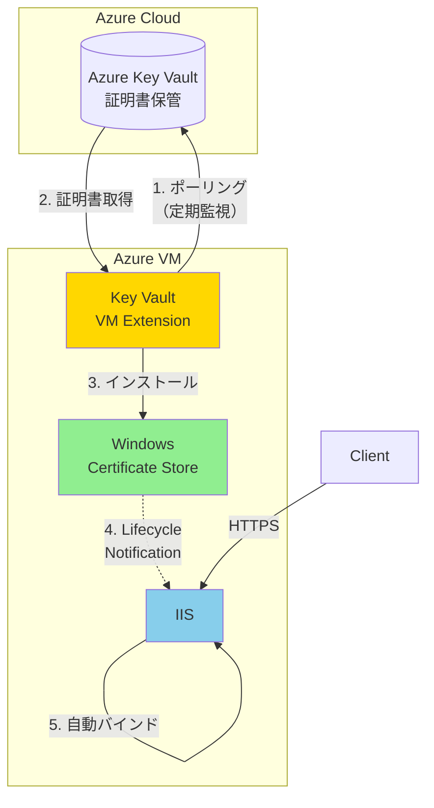
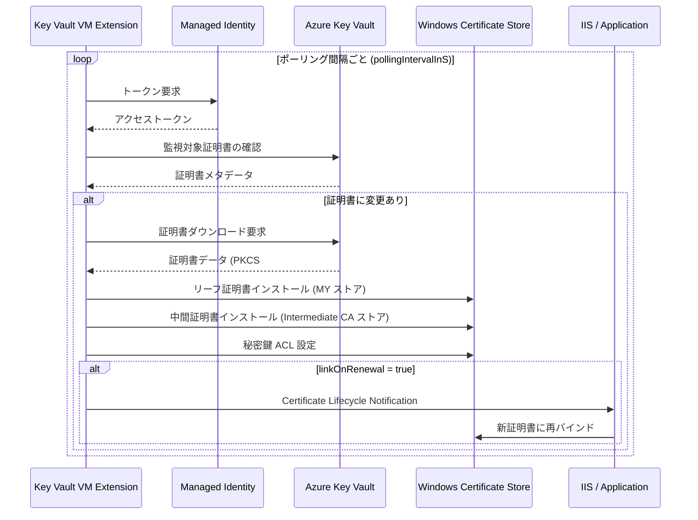
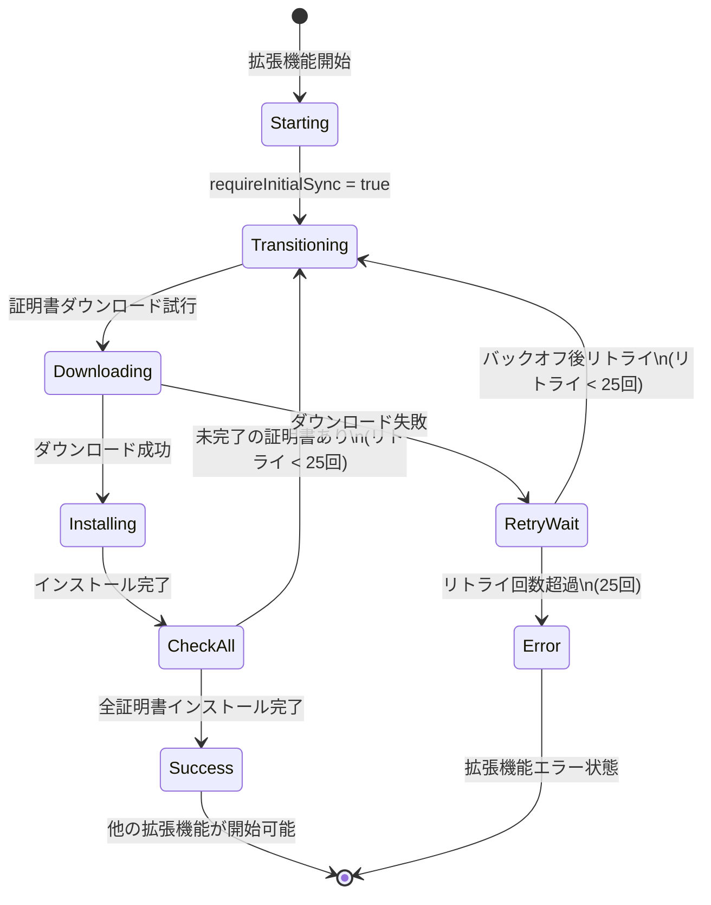
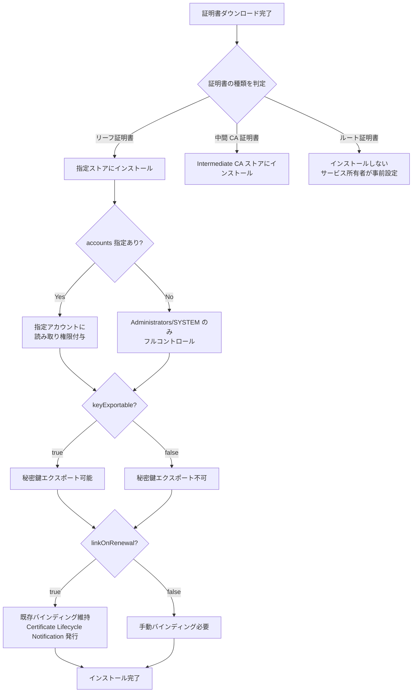
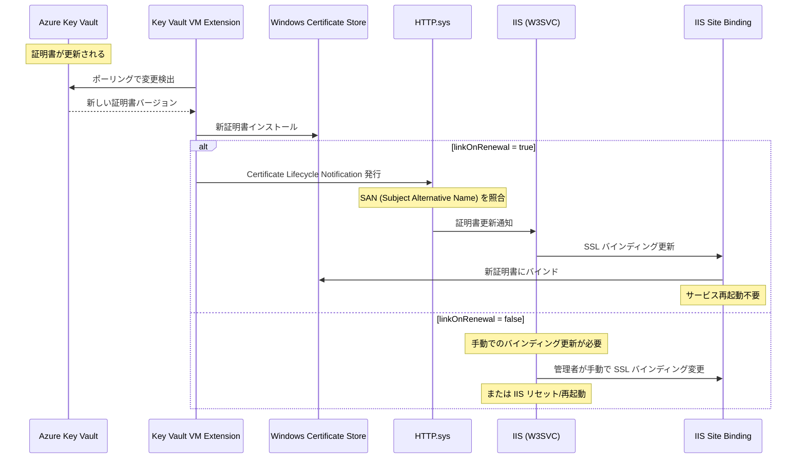
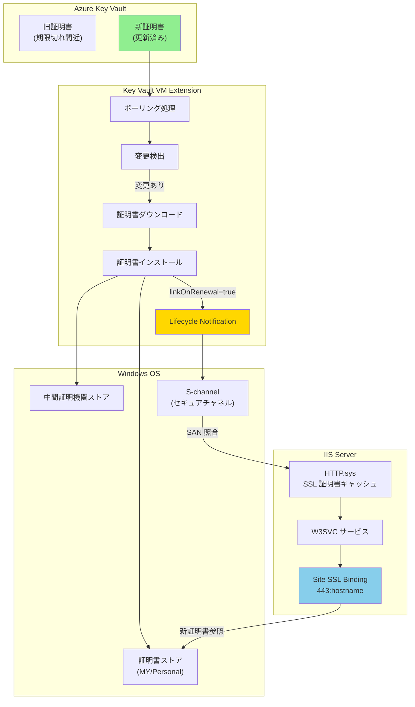
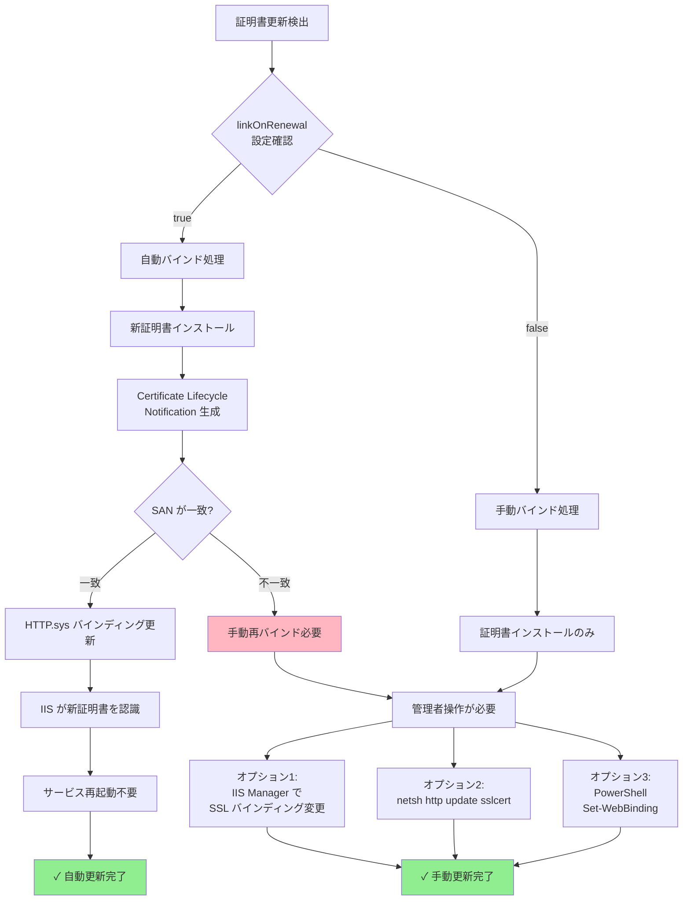

# Azure Key Vault VM 拡張機能 (Windows) フロー図

## 全体アーキテクチャ

## ポーリング・更新サイクル

## 拡張機能起動フロー（requireInitialSync = true）

## 証明書インストール詳細フロー

## IIS 証明書バインドフロー

## IIS 自動再バインドの詳細フロー

## IIS バインディング更新の条件分岐

## 参考情報

- **linkOnRenewal**: `true` に設定すると、証明書更新時に S-channel バインディングが自動維持される
- **Certificate Lifecycle Notification**: Windows の機能で、IIS 8.5 以降でサポート
- **SAN (Subject Alternative Name)**: 証明書の代替名。IIS は SAN を照合して自動再バインドを実行
