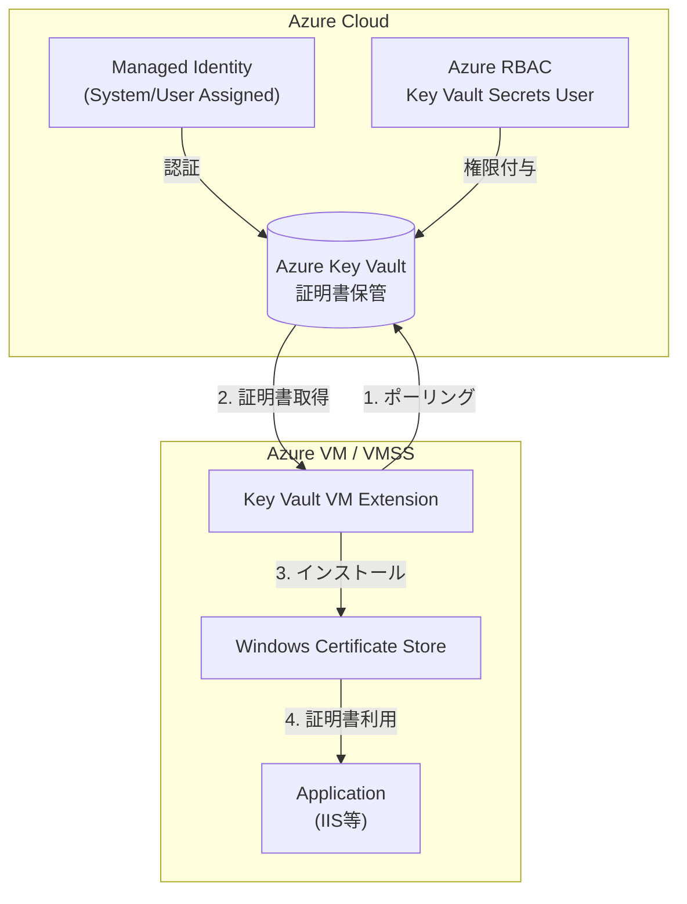
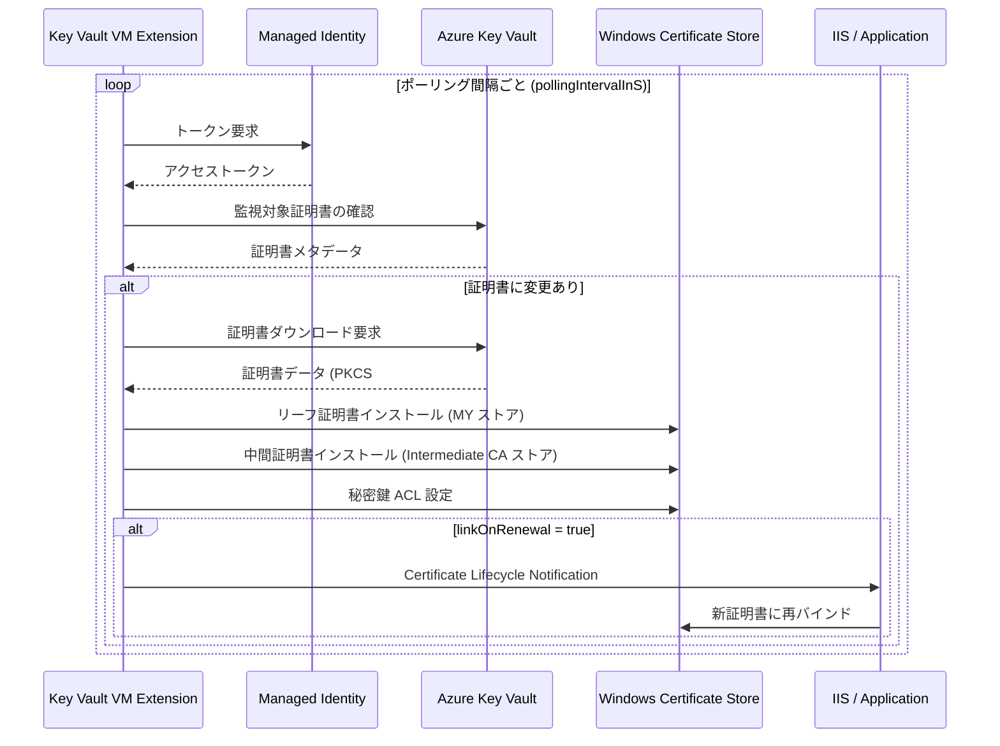
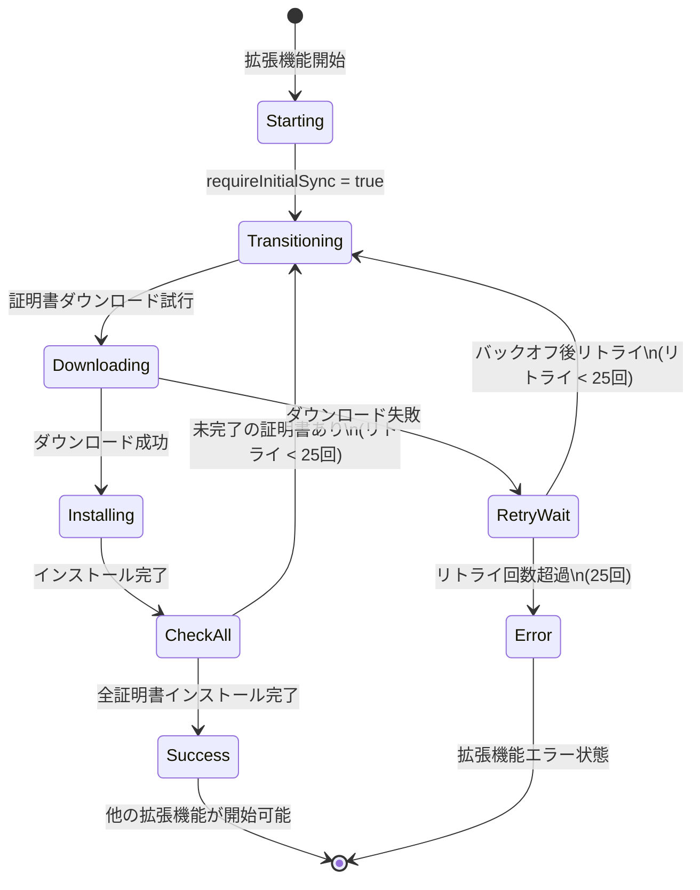
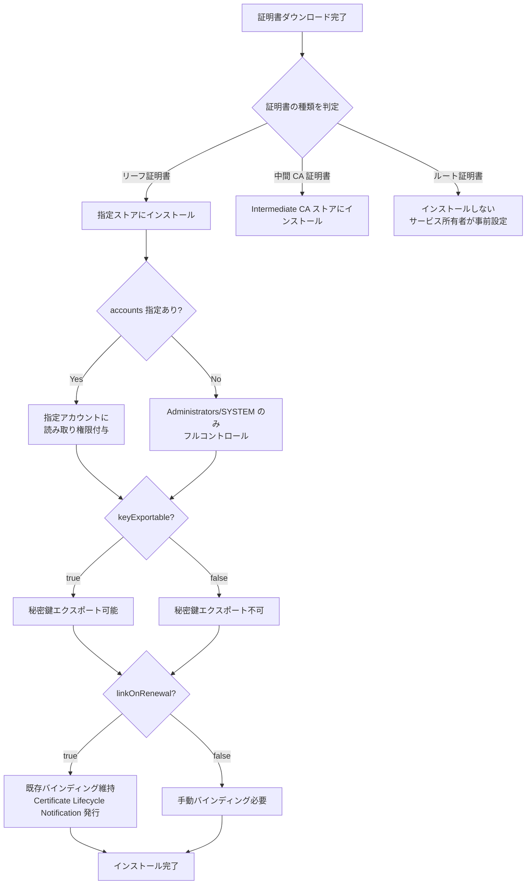

# Azure Key Vault VM 拡張機能 (Windows) 仕様

## 概要

Azure Key Vault VM 拡張機能は、Azure Key Vault に保存された証明書の自動更新機能を提供します。この拡張機能は、監視対象の証明書リストを監視し、変更を検出すると対応する証明書を取得してインストールします。

## 対応環境

### サポート OS
- Windows Server 2019 以降
- カスタムローカル VM（Windows Server 2019 core install を使用して Azure 用の特殊イメージに変換）

### サポート証明書形式
- PKCS #12
- PEM

## 前提条件

1. **Azure Key Vault インスタンス**: 証明書を含む Key Vault が必要
2. **マネージド ID**: VM にマネージド ID（システム割り当てまたはユーザー割り当て）が必要
3. **RBAC 権限**: Key Vault スコープで **Key Vault Secrets User** ロールを割り当て
   - または、旧アクセスポリシーモデルで secrets に対する **get** と **list** 権限

## 機能（バージョン 3.0）

| 機能 | 説明 |
|------|------|
| ACL 権限設定 | ダウンロードした証明書に ACL 権限を追加 |
| 証明書ストア設定 | 証明書ごとにストア構成を設定可能 |
| 秘密鍵エクスポート | 秘密鍵のエクスポートを許可/禁止 |
| IIS 証明書再バインド | 証明書更新時の自動再バインドサポート |

## 主要構成プロパティ

### secretsManagementSettings

| プロパティ | 説明 | 例 |
|-----------|------|-----|
| `pollingIntervalInS` | ポーリング間隔（秒） | `"3600"` |
| `linkOnRenewal` | 証明書更新時の S-channel バインディング維持 | `true` |
| `requireInitialSync` | 初期同期の要求（依存関係順序制御用） | `true` |
| `observedCertificates` | 監視対象証明書の配列 | 下記参照 |

### observedCertificates 配列

| プロパティ | 説明 | デフォルト |
|-----------|------|-----------|
| `url` | Key Vault シークレット URI | 必須 |
| `certificateStoreName` | 証明書ストア名 | `MY`（個人） |
| `certificateStoreLocation` | ストアの場所 | `LocalMachine` |
| `keyExportable` | 秘密鍵のエクスポート可否 | `false` |
| `accounts` | 秘密鍵への読み取りアクセスを付与するアカウント | Administrators, SYSTEM のみ |

### authenticationSettings

| プロパティ | 説明 | 必須条件 |
|-----------|------|----------|
| `msiEndpoint` | MSI エンドポイント | ユーザー割り当て ID 使用時 |
| `msiClientId` | MSI クライアント ID | ユーザー割り当て ID 使用時 |

## 証明書インストールプロセス

### インストール処理
1. **中間証明書とリーフ証明書のインストール**
   - リーフ証明書: 指定されたストア（`certificateStoreName`）と場所（`certificateStoreLocation`）にインストール
   - 中間 CA 証明書: 中間証明機関ストアにインストール
   - ルート証明書: インストール**されない**（サービス所有者が事前に信頼設定が必要）

2. **秘密鍵のアクセス制御**
   - デフォルト: Administrators と SYSTEM がフルコントロール
   - `accounts` 配列で指定されたアカウントに読み取りアクセスを付与

3. **証明書更新時の動作（`linkOnRenewal: true` の場合）**
   - 新しい証明書を既存のバインディングにリンク
   - IIS などの S-channel バインディングを自動更新

## 拡張機能依存関係順序制御

`requireInitialSync: true` を設定すると：
- 拡張機能は全証明書のダウンロード・インストール完了まで「成功」を報告しない
- 最大 25 回のリトライ（増加するバックオフ期間）
- リトライ中は **Transitioning** 状態
- リトライ完了後も失敗の場合は **Error** 状態
- 成功時のみ他の拡張機能が開始可能

> ⚠️ **注意**: この機能は、システム割り当て ID を作成して Key Vault アクセスポリシーを更新する ARM テンプレートとは互換性がありません（デッドロック発生）。ユーザー割り当て ID を使用し、事前に Key Vault の ACL を設定してください。

## ログファイルの場所

| パス | 内容 |
|------|------|
| `C:\WindowsAzure\Logs\WaAppAgent.log` | 拡張機能の更新ログ |
| `C:\WindowsAzure\Logs\Plugins\Microsoft.Azure.KeyVault.KeyVaultForWindows\<version>\` | 証明書ダウンロード状態 |
| `C:\Packages\Plugins\Microsoft.Azure.KeyVault.KeyVaultForWindows\<version>\RuntimeSettings\` | akvvm_service サービスのログ |
| `C:\Packages\Plugins\Microsoft.Azure.KeyVault.KeyVaultForWindows\<version>\Status\` | 構成とバイナリ |

## 動作フロー図（Mermaid）

### 全体アーキテクチャ



### ポーリング・更新サイクル



### 拡張機能起動フロー（requireInitialSync = true）



### 証明書インストール詳細フロー



## デプロイ例

### Azure CLI

```bash
az vm extension set \
  --name "KeyVaultForWindows" \
  --publisher Microsoft.Azure.KeyVault \
  --resource-group "<resourcegroup>" \
  --vm-name "<vmName>" \
  --settings "@settings.json"
```

### Azure PowerShell

```powershell
Set-AzVmExtension -TypeHandlerVersion "3.0" `
  -ResourceGroupName <ResourceGroupName> `
  -Location <Location> `
  -VMName <VMName> `
  -Name "KeyVaultForWindows" `
  -Publisher "Microsoft.Azure.KeyVault" `
  -Type "KeyVaultForWindows" `
  -SettingString $settings
```

## 参考リンク

- [Azure Key Vault virtual machine extension for Windows](https://learn.microsoft.com/en-us/azure/virtual-machines/extensions/key-vault-windows)
- [Azure Key Vault 概要](https://learn.microsoft.com/en-us/azure/key-vault/general/overview)
- [マネージド ID の概要](https://learn.microsoft.com/en-us/azure/active-directory/managed-identities-azure-resources/overview)
