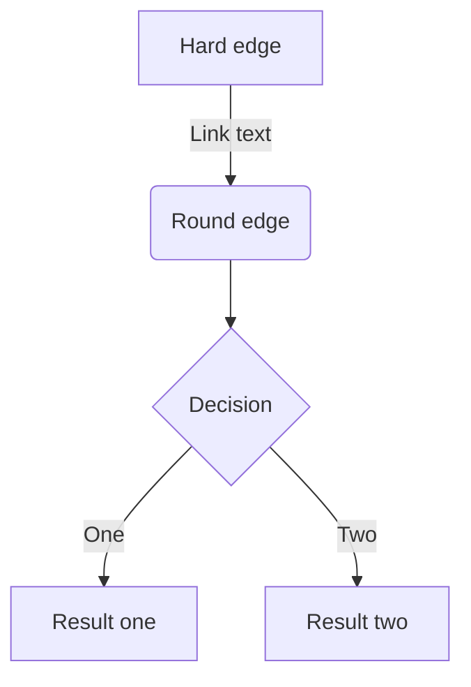
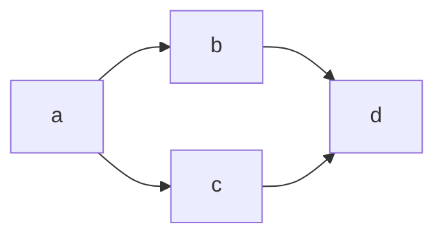

# Zenn Markdown 記法一覧

このドキュメントは [ZennのMarkdown記法一覧](https://zenn.dev/zenn/articles/markdown-guide) から抽出した内容です。

---

## 見出し

```md
# 見出し1
## 見出し2
### 見出し3
#### 見出し4
```

> ⚠️ アクセシビリティの観点から`見出し2`から始めることをおすすめします

---

## リスト

### 箇条書きリスト

```md
- Hello!
- Hola!
  - Bonjour!
  * Hi!
```

リストのアイテムには`*`もしくは`-`を使います。

### 番号付きリスト

```md
1. First
2. Second
```

---

## テキストリンク

```md
[アンカーテキスト](リンクのURL)
```

**例:**
```md
[アンカーテキスト](https://zenn.dev/)
```

> 💡 Markdownエディタでは、テキストを範囲選択した状態でURLをペーストすることで選択範囲がリンクになります。

---

## 画像

### 基本

```md

```

### 画像の横幅を指定する

URL の後に半角スペースを空けて`=○○x`と記述すると、画像の幅を px 単位で指定できます。

```md

```

### Altテキストを指定する

```md

```

### キャプションをつける

画像のすぐ下の行に`*`で挟んだテキストを配置すると、キャプションのような見た目で表示されます。

```md

*キャプション*
```

### 画像にリンクを貼る

```md
[](リンクのURL)
```

---

## テーブル

```md
| Head | Head | Head |
| ---- | ---- | ---- |
| Text | Text | Text |
| Text | Text | Text |
```

> 💡 `<br>`タグを使ってセル内で改行できます。

---

## コードブロック

コードは「```」で挟むことでブロックとして挿入できます。言語を指定するとシンタックスハイライトが適用されます。

````md
```js
const great = () => {
  console.log("Awesome");
};
```
````

シンタックスハイライトには **Shiki** を使用しています。[対応言語の一覧](https://shiki.style/languages)

### ファイル名を表示する

`言語:ファイル名`と`:`区切りで記載することで、ファイル名がコードブロックの上部に表示されます。

````md
```js:fooBar.js
const great = () => {
  console.log("Awesome")
}
```
````

### diff のシンタックスハイライト

`diff`と言語のハイライトを同時に適用するには、`diff`と`言語名`を半角スペース区切りで指定します。

````md
```diff js
@@ -4,6 +4,5 @@
+    const foo = bar.baz([1, 2, 3]) + 1;
-    let foo = bar.baz([1, 2, 3]);
```
````

ファイル名も同時に指定可能：

````md
```diff js:fooBar.js
@@ -4,6 +4,5 @@
+    const foo = bar.baz([1, 2, 3]) + 1;
-    let foo = bar.baz([1, 2, 3]);
```
````

> ⚠️ `diff`の使用時には、先頭に`+`、`-`、`>`、`<`、`半角スペース`のいずれかが入っていない行はハイライトされません。

---

## 数式

Zenn では **KaTeX** による数式表示に対応しています。

[KaTeXがサポートする記法の一覧](https://katex.org/docs/support_table.html)

### 数式のブロックを挿入する

`$$`で記述を挟むことで、数式のブロックが挿入されます。

```md
$$
e^{i\theta} = \cos\theta + i\sin\theta
$$
```

> ⚠️ `$$`の前後は空の行でないと正しく埋め込まれないことがあります。

### インラインで数式を挿入する

`$`ひとつで挟むことで、インラインで数式を含めることができます。

```md
$a\ne0$
```

---

## 引用

```md
> 引用文
> 引用文
```

---

## 脚注

脚注を指定するとページ下部にその内容が表示されます。

```md
脚注の例[^1]です。インライン^[脚注の内容その2]で書くこともできます。

[^1]: 脚注の内容その1
```

---

## 区切り線

```md
-----
```

---

## インラインスタイル

```md
*イタリック*
**太字**
~~打ち消し線~~
インラインで`code`を挿入する
```

### インラインのコメント

自分用のメモをしたいときは HTML のコメント記法を使用できます。

```md
<!-- TODO: ◯◯について追記する -->
```

> ⚠️ この形式で書いたコメントは公開されたページ上では表示されません。ただし、複数行のコメントには対応していません。

---

## Zenn 独自の記法

### メッセージ

```md
:::message
メッセージをここに
:::
```

```md
:::message alert
警告メッセージをここに
:::
```

### アコーディオン（トグル）

```md
:::details タイトル
表示したい内容
:::
```

#### 要素をネストさせるには

外側の要素の開始/終了に `:` を追加します。

```md
::::details タイトル
:::message
ネストされた要素
:::
::::
```

---

## コンテンツの埋め込み

### リンクカード

URL だけが貼り付けられた行があると、その部分がカードとして表示されます。

```md
https://zenn.dev/zenn/articles/markdown-guide
```

または `@[card](URL)` という書き方でもカード型のリンクを貼ることができます。

### X（Twitter）のポスト（ツイート）

ポストのURLを貼り付けるだけで埋め込みが表示されます。

```md
https://twitter.com/jack/status/20

# x.comドメインの場合
https://x.com/jack/status/20
```

#### リプライ元のポストを非表示にする

クエリパラメータに`conversation=none`を指定します。

```md
https://twitter.com/jack/status/20?conversation=none
```

### YouTube

動画URLを貼り付けるだけで動画を埋め込むことができます。

```md
https://www.youtube.com/watch?v=WRVsOCh907o
```

### GitHub

GitHub上のファイルへのURLまたはパーマリンクだけの行を作成すると、その部分にGitHubの埋め込みが表示されます。

```md
https://github.com/octocat/Hello-World/blob/master/README
```

#### 行の指定

リンクの末尾に`#L00-L00`のような形で開始行と終了行を指定できます。

```md
https://github.com/octocat/Spoon-Knife/blob/main/README.md#L1-L3
```

開始行のみ指定することも可能：

```md
https://github.com/octocat/Spoon-Knife/blob/main/README.md#L3
```

> ⚠️ 埋め込めるファイルは、ソースコードなどのテキストファイルのみです。

### GitHub Gist

```md
@[gist](GistのページURL)
```

特定のファイルだけ埋め込みたい場合：

```md
@[gist](https://gist.github.com/foo/bar?file=example.json)
```

### CodePen

```md
@[codepen](ページのURL)
```

デフォルトの表示タブを変更する場合：

```md
@[codepen](ページのURL?default-tab=html,css)
```

### SlideShare

```md
@[slideshare](スライドのkey)
```

SlideShare の埋め込み iframe に含まれる`...embed_code/key/○○...`の`◯◯`の部分を入力します。

### SpeakerDeck

```md
@[speakerdeck](スライドのID)

# 例
@[speakerdeck](4f926da9cb4cd0001f00a1ff)
@[speakerdeck](4f926da9cb4cd0001f00a1ff?slide=24)
```

SpeakerDeck で取得した埋め込みコードに含まれる`data-id`の値を入力します。スライド番号も指定できます。

### Docswell

```md
@[docswell](スライドのURL)
# もしくは
@[docswell](埋め込み用のURL)

# 例
@[docswell](https://www.docswell.com/s/ku-suke/LK7J5V-hello-docswell)
@[docswell](https://www.docswell.com/s/ku-suke/LK7J5V-hello-docswell#p13)
@[docswell](https://www.docswell.com/slide/LK7J5V/embed)
```

### JSFiddle

```md
@[jsfiddle](ページのURL)
```

[埋め込みオプション](https://docs.jsfiddle.net/embedding-fiddles)を指定する場合、iframe用の埋め込みURL（`ページのURL + /embedded/{Tabs}/{Visual}/`）を入力します。

### CodeSandbox

```md
@[codesandbox](embed用のURL)
```

CodeSandbox の各ページから埋め込み用の`<iframe>`を取得し、`src`の URL を括弧の中に入力します。

### StackBlitz

```md
@[stackblitz](embed用のURL)
```

StackBlitz の各ページから「Embed URL」を取得し、そのまま括弧の中に入力します。

### Figma

```md
@[figma](ファイルまたはプロトタイプのURL)
```

Figma でファイルまたはプロトタイプのページから共有リンクを取得し、そのまま括弧の中に入力します。

### blueprintUE

```md
@[blueprintue](ページのURL)

# 例
@[blueprintue](https://blueprintue.com/render/0ovgynk-/)
```

---

## ダイアグラム

**mermaid.js** によるダイアグラム表示に対応しています。コードブロックの言語名を`mermaid`とすることで自動的にレンダリングされます。

````md

````

他にもシーケンス図やクラス図が表示できます。文法は [mermaid.js公式サイト](https://mermaid-js.github.io/mermaid/#/flowchart) を参照してください。

### 制限事項

#### クリックイベントの無効化

セキュリティの観点で Interaction 機能（クリックイベントなど）は無効にされています。

#### ブロックあたりの文字数制限

2000文字以内に制限されています。

#### ブロックあたりのChain数制限

フローチャートにおける`&`の数は10に制限されています。



---

## 入力補完

### 絵文字（Emoji）

Markdownエディタで`:`に続いて任意の1文字を入力すると、絵文字の候補が表示されます。

---

## その他の Tips

- **改行**: Enter キーで改行できます（markdown-it の breaks オプションが有効）
- **`<br>`タグ**: テーブル内の改行などで使用可能
- **HTMLタグ**: 基本的に `<br>` 以外のHTMLタグの埋め込みには対応していません

---

## 参考リンク

- [ZennのMarkdown記法一覧（公式）](https://zenn.dev/zenn/articles/markdown-guide)
- [KaTeX Supported Functions](https://katex.org/docs/support_table.html)
- [Shiki 対応言語一覧](https://shiki.style/languages)
- [mermaid.js 公式ドキュメント](https://mermaid-js.github.io/mermaid/#/)
